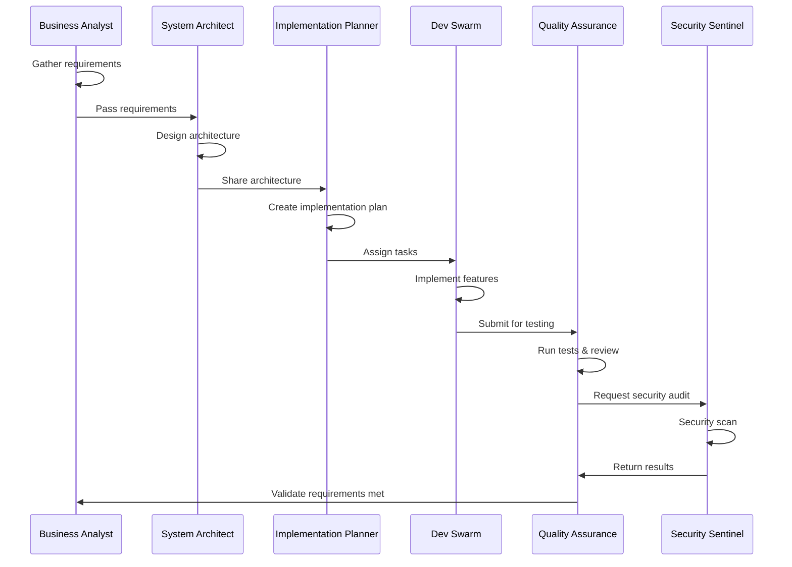

# 🤖 Multi-Agent SDLC Framework

> **A production-ready, enterprise-grade framework for agent-driven software development**

[](https://github.com/mohitkesarwani/multi-agent-sdlc-framework/actions)
[](https://github.com/mohitkesarwani/multi-agent-sdlc-framework/actions)
[](https://opensource.org/licenses/MIT)

## 📋 Table of Contents
- [Introduction](#introduction)
- [Agent-Driven Development](#agent-driven-development)
- [Multi-Agent Workflow Navigation](#️-multi-agent-workflow-navigation)
- [Quick Start](#quick-start)
- [Quick Start for Orchestrator](#-quick-start-for-orchestrator)
- [Sprint Execution Guide](#-sprint-execution-guide)
- [Features](#features)
- [Directory Structure](#directory-structure)
- [How Agents Work](#how-agents-work)
- [Installation](#installation)
- [Usage](#usage)
- [Docker Support](#docker-support)
- [CI/CD](#cicd)
- [Documentation](#documentation)
- [Contributing](#contributing)
- [License](#license)

## 🎯 Introduction

The **Multi-Agent SDLC Framework** is a revolutionary approach to software development that leverages autonomous AI agents to automate and optimize the entire Software Development Life Cycle (SDLC). This framework provides a complete, production-ready template that can be cloned and customized for any project.

### Why Multi-Agent SDLC?

- ⚡ **Accelerated Development**: AI agents work in parallel to speed up development cycles
- 🎯 **Consistent Quality**: Automated quality checks ensure enterprise-grade standards
- 🔒 **Security First**: Built-in security agents monitor and enforce best practices
- 📊 **Data-Driven Decisions**: Agents analyze and optimize based on metrics
- 🔄 **Continuous Improvement**: Iterative feedback loops enhance code quality
- 🌐 **Full-Stack Coverage**: Agents handle frontend, backend, database, and infrastructure

## 🤖 Agent-Driven Development

This framework employs **six specialized AI agents** that collaborate throughout the SDLC:

### 1. 📝 Requirement Agent
- Gathers and analyzes business requirements
- Creates user stories and acceptance criteria
- Identifies technical constraints and dependencies

### 2. 🏗️ System Architect
- Designs system architecture and component interactions
- Defines data models and API contracts
- Ensures scalability and maintainability

### 3. 📋 Implementation Planner
- Breaks down features into actionable tasks
- Estimates effort and identifies risks
- Creates implementation roadmaps

### 4. 👨‍💻 FullStack Dev Swarm
- Implements features across frontend and backend
- Writes clean, maintainable code
- Follows best practices and design patterns

### 5. 🧪 Quality Assurance
- Creates comprehensive test suites
- Performs code reviews and quality checks
- Validates functionality against requirements

### 6. 🛡️ Security Sentinel
- Conducts security audits and vulnerability scans
- Enforces security best practices
- Monitors for security issues continuously

## 🗺️ Multi-Agent Workflow Navigation

This framework guides you through a structured, **6-phase workflow** with built-in approval gates to ensure quality and alignment at every step.

### **Phase 1: Discovery** 🔍
**Agent:** BA (Business Analyst / Requirement Agent)  
**Purpose:** Gather and document business requirements

**What Happens:**
- BA Agent interviews stakeholders and captures business goals
- Creates detailed user stories with acceptance criteria
- Documents functional and non-functional requirements
- Updates `PROJECT_KNOWLEDGE.md` with requirements

**Deliverables:**
- ✅ User stories and acceptance criteria
- ✅ Business requirements documentation
- ✅ Technical constraints and dependencies identified

**Next:** Proceed to Phase 2 (Architecture Design)

---

### **Phase 2: Architecture Design** 🏗️
**Agent:** System Architect  
**Purpose:** Design system architecture, data models, and API contracts

**What Happens:**
- Architect reads requirements from `PROJECT_KNOWLEDGE.md`
- Designs MongoDB schema (Mongoose models)
- Defines REST API contracts (endpoints, request/response formats)
- Creates Entity Relationship Diagrams (ERD)
- Ensures scalability, performance, and data consistency

**Deliverables:**
- ✅ MongoDB schema design (all Mongoose models)
- ✅ API contract specifications
- ✅ ERD diagrams
- ✅ Architecture documentation in `PROJECT_KNOWLEDGE.md`

**Next:** Proceed to Phase 3 (Implementation Planning)

---

### **Phase 3: Implementation Planning** 📋
**Agent:** Implementation Planner  
**Purpose:** Break work into sprints and create actionable tasks

**What Happens:**
- Planner reads requirements and architecture from `PROJECT_KNOWLEDGE.md`
- Breaks features into sprint-based tasks
- Estimates effort and identifies dependencies
- Creates detailed implementation roadmap
- **🚨 APPROVAL GATE #1:** Human must review and approve the plan

**Deliverables:**
- ✅ Sprint breakdown with tasks
- ✅ Effort estimates
- ✅ Dependency graph
- ✅ Risk assessment

**Approval Required:** ⏸️ **YES** - Human must approve plan before proceeding

**Next:** After approval, proceed to Phase 4 (Code Generation)

---

### **Phase 4: Code Generation** 👨‍💻
**Agent:** Dev Swarm (Backend + Frontend Developers)  
**Purpose:** Generate production-ready code for all features

**What Happens:**
- Backend Developer generates:
  - Mongoose models (User, Application, Document, Loan, etc.)
  - Express routes and controllers
  - Validation middleware (Zod/Joi)
  - Integration services (Green ID, Illion, Bureau checks, HelloSign)
  - Authentication & authorization (JWT, passwordless)
- Frontend Developer generates:
  - React components (auth, onboarding, document upload, verification)
  - API service layer
  - State management (Context API or Redux)
  - Form validation and UI/UX

**Deliverables:**
- ✅ Complete backend codebase (Node.js/Express)
- ✅ Complete frontend codebase (React/Vite)
- ✅ Integration services fully implemented
- ✅ Environment configuration templates (.env.example)
- ✅ Code follows best practices and design patterns

**Next:** Proceed to Phase 5 (Testing & QA)

---

### **Phase 5: Testing & QA** 🧪
**Agent:** Quality Assurance Agent  
**Purpose:** Validate code quality and functionality

**What Happens:**
- QA Agent writes comprehensive test suites:
  - Unit tests (Jest for backend, Vitest for frontend)
  - Integration tests
  - API endpoint tests
  - Component tests
- Runs all tests and generates coverage reports
- Validates coverage meets threshold (>80%)
- **Loops back to Phase 4** if tests fail or coverage is insufficient

**Deliverables:**
- ✅ Complete test suites (unit, integration, E2E)
- ✅ Test coverage reports (>80% coverage)
- ✅ All tests passing
- ✅ Quality validation passed

**Next:** Proceed to Phase 6 (Security Audit)

---

### **Phase 6: Security Audit** 🛡️
**Agent:** Security Sentinel  
**Purpose:** Ensure code is secure and vulnerability-free

**What Happens:**
- Security Agent scans for:
  - NoSQL injection vulnerabilities
  - XSS vulnerabilities
  - Hardcoded secrets
  - Insecure authentication/authorization
  - CORS misconfigurations
  - Dependency vulnerabilities
- **🚨 APPROVAL GATE #2:** Human must review security findings (if high/critical severity)

**Deliverables:**
- ✅ Security audit report
- ✅ Vulnerability scan results
- ✅ No critical or high-severity issues (or approved exceptions)
- ✅ Security best practices enforced

**Approval Required:** ⏸️ **YES** - Human must approve if high/critical issues found

**Next:** Ready for deployment! 🚀

---

### **Workflow Summary**
```
Discovery → Architecture → Planning [APPROVAL GATE #1] → Development → Testing → Security [APPROVAL GATE #2] → Deployment
```

### **Key Points**
- ✅ **Sequential Execution:** Each phase must complete before the next begins
- ✅ **Approval Gates:** Human intervention required at Planning and Security phases
- ✅ **Iterative Development:** Testing phase can loop back to Development if tests fail
- ✅ **Single Source of Truth:** `PROJECT_KNOWLEDGE.md` maintains state across all phases
- ✅ **Automated Quality:** Built-in quality checks at every phase

## 🚀 Quick Start

Get started in under 5 minutes:

```bash
# 1. Clone the repository
git clone https://github.com/mohitkesarwani/multi-agent-sdlc-framework.git
cd multi-agent-sdlc-framework

# 2. Run setup script
./scripts/setup.sh

# 3. Update environment variables
nano src/backend/.env  # Add your configuration

# 4. Initialize backend
./scripts/init-backend.sh

# 5. Start with Docker Compose
docker-compose -f infrastructure/docker/docker-compose.yml up
```

Or start services individually:
```bash
# Backend
cd src/backend && npm run dev

# Frontend (in another terminal)
cd src/frontend && npm run dev
```

🎉 Visit `http://localhost:3000` to see your application!

## 🎯 Quick Start for Orchestrator

The orchestrator is the **brain** of the multi-agent framework. It coordinates all agents through the 6-phase workflow described above.

### Prerequisites
- Node.js 16+ installed
- Your project requirements documented (can be in any format)
- GitHub repository set up (if pushing code to consumer-lending-app or another repo)

### Running the Orchestrator

#### Step 1: Prepare Your Requirements
Create or update `docs/PROJECT_KNOWLEDGE.md` with your business requirements:

```bash
# Edit the PROJECT_KNOWLEDGE.md file
nano docs/PROJECT_KNOWLEDGE.md
```

**For consumer-lending-app**, include requirements like:
- Passwordless authentication (email magic link)
- User onboarding flow
- Driver license upload & OCR
- Green ID integration (Australian identity verification)
- Illion bank scrape integration
- Bureau credit checks
- Consumer verification
- Loan decision engine

#### Step 2: Start the Orchestrator
```bash
node orchestrator.js
```

The orchestrator will guide you through each phase interactively.

#### Step 3: Respond to Approval Gates
The orchestrator will pause at two critical points:

**Approval Gate #1 (Planning Phase):**
- Review the sprint breakdown and task list
- Type `approve` to continue or `reject` to revise

**Approval Gate #2 (Security Audit):**
- Review security scan results
- Type `approve` to proceed to deployment or `reject` to fix issues

#### Step 4: Review Generated Code
After each phase, review outputs:
- **Architecture:** Check `PROJECT_KNOWLEDGE.md` for schema and API design
- **Development:** Review generated code in `src/backend/` and `src/frontend/`
- **Testing:** Review test results and coverage reports
- **Security:** Review security audit report

### Understanding the Orchestrator Output

The orchestrator provides clear visual indicators:

```
🚀 - Starting a new phase
✓ - Task completed successfully
📋 - Deliverable created
⏸️  - Approval gate (human intervention required)
✅ - Phase completed
❌ - Error occurred
🔄 - Looping back to previous phase
```

### Consumer Lending App Example

For the **consumer-lending-app** project, the orchestrator will:

1. **Discovery:** Capture requirements for Australian consumer lending
2. **Architecture:** Design MongoDB schema for User, Application, Document, Loan, etc.
3. **Planning:** Break work into sprints:
   - Sprint 1: Auth + Onboarding + Document Upload
   - Sprint 2: Green ID + Illion + Bureau Checks
   - Sprint 3: Loan Decision Engine + Agreements
4. **Development:** Generate complete codebase:
   - Backend: Express.js with Mongoose models
   - Frontend: React components for all user flows
   - Integrations: Green ID, Illion, Bureau, HelloSign APIs
5. **Testing:** Create Jest/Vitest tests with >80% coverage
6. **Security:** Audit for Australian compliance (privacy laws, data security)

### Configuring Target Repository

To push generated code to a specific repository (e.g., consumer-lending-app):

```bash
# Set environment variable before running orchestrator
export TARGET_REPO="https://github.com/mohitkesarwani/consumer-lending-app"
node orchestrator.js
```

Or update the orchestrator directly (see `orchestrator.js` configuration section).

### Troubleshooting

**Issue: Orchestrator hangs at approval gate**
- Solution: Type `approve` or `reject` and press Enter

**Issue: Generated code has errors**
- Solution: Review error messages, fix issues, and re-run the affected phase

**Issue: Tests fail in QA phase**
- Solution: The orchestrator will automatically loop back to Development. Fix code and re-test.

**Issue: Security scan finds critical issues**
- Solution: Address security issues in the code, then re-run security audit

## ✨ Features

### 🎨 Frontend (React + Vite)
- ⚛️ React 17 with functional components and hooks
- 🎨 Tailwind CSS for modern, responsive UI
- 🔄 React Router for client-side routing
- 🌐 API service layer with axios
- 🔐 JWT authentication with protected routes

### 🔧 Backend (Node.js + Express)
- 🚀 Express.js REST API
- 🗄️ MongoDB with Mongoose ODM
- 🔒 JWT-based authentication & authorization
- 🛡️ Security middleware (Helmet, CORS, rate limiting)
- ✅ Input validation with Zod
- 📝 Structured logging with Winston
- 🔄 Error handling middleware

### 🗄️ Database
- 📊 MongoDB for flexible document storage
- 🏗️ Pre-defined schemas for common entities
- 🔗 Relationship management
- 📈 Indexing for performance

### 🐳 DevOps & Infrastructure
- 🐳 Docker & Docker Compose support
- 🔄 CI/CD pipelines with GitHub Actions
- 🧪 Automated testing (unit, integration, E2E)
- 🔍 Code quality checks (ESLint, Prettier)
- 🛡️ Security scanning (CodeQL, Trivy, TruffleHog)
- 📦 Deployment automation

### 🤖 Agent Orchestration
- 🎯 Configurable agent roles and workflows
- 📋 Task assignment and tracking
- 💬 Inter-agent communication protocols
- 📊 Decision logging and audit trails
- 🔄 Iteration management

## 📁 Directory Structure

```
multi-agent-sdlc-framework/
├── 📂 .agent-config/           # Agent configuration files
│   ├── agent-roles.json        # Agent definitions and capabilities
│   ├── prompts.json            # Prompt templates for agents
│   ├── workflows.json          # Workflow definitions
│   └── checklist.json          # Quality & compliance checklists
│
├── 📂 .github/                 # GitHub configuration
│   └── workflows/              # CI/CD workflows
│       ├── test.yml            # Automated testing
│       ├── lint.yml            # Code quality checks
│       ├── security.yml        # Security scanning
│       └── deploy.yml          # Deployment pipeline
│
├── 📂 docs/                    # Documentation
│   ├── AGENT_INSTRUCTIONS.md   # Guide for AI agents
│   ├── AGENT_FRAMEWORK.md      # Framework architecture
│   ├── TEMPLATE_USAGE.md       # How to use as template
│   ├── REQUIREMENTS_TEMPLATE.md # Requirements gathering
│   ├── ARCHITECTURE_TEMPLATE.md # Architecture docs
│   ├── SECURITY_CHECKLIST.md   # Security requirements
│   └── QUICK_START.md          # Quick start guide
│
├── 📂 infrastructure/          # Infrastructure as code
│   └── docker/                 # Docker configuration
│       ├── Dockerfile.backend  # Backend container
│       ├── Dockerfile.frontend # Frontend container
│       ├── docker-compose.yml  # Local dev setup
│       └── nginx.conf          # Nginx configuration
│
├── 📂 scripts/                 # Utility scripts
│   ├── setup.sh                # Initial setup
│   ├── init-backend.sh         # Backend initialization
│   ├── install-deps.sh         # Install dependencies
│   ├── migrate.sh              # Database migrations
│   └── README.md               # Scripts documentation
│
├── 📂 src/                     # Source code
│   ├── 📂 backend/             # Backend API
│   │   ├── config/             # Configuration files
│   │   ├── controllers/        # Route controllers
│   │   ├── middleware/         # Express middleware
│   │   ├── models/             # Mongoose models
│   │   ├── routes/             # API routes
│   │   ├── services/           # Business logic
│   │   ├── package.json        # Backend dependencies
│   │   ├── .env.example        # Environment template
│   │   └── server.js           # Entry point
│   │
│   └── 📂 frontend/            # Frontend application
│       ├── components/         # React components
│       ├── pages/              # Page components
│       ├── context/            # React context
│       ├── services/           # API services
│       ├── styles/             # CSS files
│       └── main.jsx            # Entry point
│
├── 📜 orchestrator.js          # Agent orchestration engine
├── 📜 package.json             # Root dependencies
├── 📜 .env.example             # Environment template
└── 📜 README.md                # This file
```

## 🔄 How Agents Work

### Workflow Example: New Feature Development



### Agent Communication Protocol

Agents communicate through a **centralized knowledge base** (`PROJECT_KNOWLEDGE.md`) that serves as the single source of truth. Each agent:

1. **Reads** the current state and previous decisions
2. **Performs** its specialized tasks
3. **Writes** results, decisions, and next steps
4. **Triggers** the next agent in the workflow

### Configuration

Agents are configured through JSON files in `.agent-config/`:
- **agent-roles.json**: Defines agent capabilities and responsibilities
- **prompts.json**: Contains prompt templates for different tasks
- **workflows.json**: Specifies execution flows and decision points
- **checklist.json**: Quality gates and validation criteria

## 📖 Sprint Execution Guide

This guide provides step-by-step instructions for executing specific sprints using the multi-agent framework.

### Understanding Sprints

Sprints are time-boxed iterations (typically 1-2 weeks) where specific features are implemented, tested, and deployed. Each sprint follows the complete 6-phase workflow.

### Sprint 1 Example: Consumer Lending App

**Sprint 1 Goals:**
- Passwordless Authentication (Magic Link)
- User Onboarding Flow
- Driver License Upload & Storage
- Green ID Integration (Australian Identity Verification)
- Illion Bank Scrape Integration
- Bureau Credit Checks
- Consumer Verification
- Loan Decision Engine (Basic)

### Step-by-Step Sprint Execution

#### **Step 1: Prepare Sprint Requirements**

Update `docs/PROJECT_KNOWLEDGE.md` with sprint-specific requirements:

```markdown
## SPRINT 1 REQUIREMENTS

### Feature 1: Passwordless Authentication
**User Story:** As a user, I want to log in using a magic link sent to my email, so I don't need to remember passwords.

**Acceptance Criteria:**
- User enters email address
- System sends magic link to email
- Link expires after 15 minutes
- User clicks link and is authenticated
- JWT token issued for subsequent requests

**Technical Requirements:**
- Express route: POST /api/auth/request-magic-link
- Express route: GET /api/auth/verify-magic-link/:token
- MongoDB: User model with email verification
- Email service integration (SendGrid/Mailgun)

### Feature 2: User Onboarding Flow
**User Story:** As a new user, I want a guided onboarding process to provide my information step-by-step.

**Acceptance Criteria:**
- Multi-step form (Personal Info → Employment → Documents → Review)
- Form validation at each step
- Progress indicator
- Save progress (resume later)
- Submit application

**Technical Requirements:**
- React components: OnboardingWizard, StepPersonalInfo, StepEmployment, StepDocuments
- Express route: POST /api/applications
- MongoDB: Application model

[... Continue for all Sprint 1 features ...]
```

#### **Step 2: Run the Orchestrator**

```bash
node orchestrator.js
```

The orchestrator will guide you through:

1. **Discovery Phase:**
   - BA Agent reads `PROJECT_KNOWLEDGE.md`
   - Extracts user stories for Sprint 1
   - Confirms requirements with you

2. **Architecture Phase:**
   - System Architect designs MongoDB models:
     - `User.js` (email, magicLinkToken, magicLinkExpiry, isVerified)
     - `Application.js` (userId, personalInfo, employment, documents, status)
     - `Document.js` (applicationId, type, url, verificationStatus)
     - `BankStatement.js` (applicationId, illionData, transactionHistory)
     - `VerificationResult.js` (applicationId, greenIdResult, bureauResult)
     - `Loan.js` (applicationId, amount, term, status, decisionData)
   - Architect defines API contracts for all endpoints

3. **Planning Phase (APPROVAL GATE #1):**
   - Planner breaks Sprint 1 into tasks:
     ```
     Task 1: Implement passwordless auth backend (4h)
     Task 2: Implement passwordless auth frontend (3h)
     Task 3: Implement user onboarding backend (6h)
     Task 4: Implement user onboarding frontend (8h)
     Task 5: Implement document upload (5h)
     Task 6: Integrate Green ID API (6h)
     Task 7: Integrate Illion API (6h)
     Task 8: Implement bureau credit check (4h)
     Task 9: Implement loan decision engine (8h)
     Task 10: Write tests for all features (8h)
     ```
   - **⏸️ APPROVE THIS PLAN** before proceeding

#### **Step 3: Review Generated Code**

After Development Phase, review the generated code:

```bash
# Backend files generated
src/backend/models/User.js
src/backend/models/Application.js
src/backend/models/Document.js
src/backend/models/BankStatement.js
src/backend/models/VerificationResult.js
src/backend/models/Loan.js

src/backend/routes/auth.js
src/backend/routes/applications.js
src/backend/routes/documents.js
src/backend/routes/verifications.js
src/backend/routes/loans.js

src/backend/controllers/authController.js
src/backend/controllers/applicationController.js
src/backend/controllers/documentController.js
src/backend/controllers/verificationController.js
src/backend/controllers/loanController.js

src/backend/services/emailService.js
src/backend/services/greenIdService.js
src/backend/services/illionService.js
src/backend/services/bureauService.js
src/backend/services/loanDecisionService.js

src/backend/middleware/authMiddleware.js
src/backend/middleware/validationMiddleware.js

# Frontend files generated
src/frontend/pages/Login.jsx
src/frontend/pages/MagicLinkSent.jsx
src/frontend/pages/Onboarding.jsx
src/frontend/pages/Dashboard.jsx

src/frontend/components/OnboardingWizard.jsx
src/frontend/components/PersonalInfoStep.jsx
src/frontend/components/EmploymentStep.jsx
src/frontend/components/DocumentUploadStep.jsx
src/frontend/components/ReviewStep.jsx

src/frontend/services/authService.js
src/frontend/services/applicationService.js
src/frontend/services/documentService.js

src/frontend/context/AuthContext.jsx
src/frontend/context/ApplicationContext.jsx

# Test files generated
src/backend/tests/auth.test.js
src/backend/tests/applications.test.js
src/backend/tests/integrations.test.js
src/frontend/tests/Login.test.jsx
src/frontend/tests/Onboarding.test.jsx
```

#### **Step 4: Review Test Results**

After Testing Phase, review the output:

```
📊 Test Results Summary:

Backend Tests (Jest):
✅ Auth endpoints: 12/12 tests passed
✅ Application endpoints: 18/18 tests passed
✅ Document endpoints: 10/10 tests passed
✅ Integration services: 15/15 tests passed
✅ Total: 55/55 tests passed
✅ Coverage: 87% (exceeds 80% threshold)

Frontend Tests (Vitest):
✅ Login component: 8/8 tests passed
✅ Onboarding wizard: 14/14 tests passed
✅ Document upload: 6/6 tests passed
✅ Total: 28/28 tests passed
✅ Coverage: 82% (exceeds 80% threshold)
```

#### **Step 5: Review Security Audit**

After Security Phase, review findings:

```
🛡️ Security Audit Report:

✅ No hardcoded secrets found
✅ No SQL/NoSQL injection vulnerabilities
✅ No XSS vulnerabilities
✅ CORS properly configured
✅ JWT validation implemented correctly
✅ Rate limiting enabled on auth endpoints
✅ File upload validation implemented
✅ Australian Privacy Act compliance verified

⚠️ Recommendations:
- Consider adding 2FA for high-value transactions
- Implement audit logging for all data access
- Add encryption at rest for sensitive documents
```

**⏸️ APPROVE SECURITY AUDIT** to proceed to deployment

#### **Step 6: Deploy Sprint Code**

After approval, code is ready for deployment:

```bash
# Option 1: Push to consumer-lending-app repository
git push origin sprint-1-implementation

# Option 2: Deploy to staging environment
./scripts/deploy-staging.sh

# Option 3: Deploy to production (after staging validation)
./scripts/deploy-production.sh
```

### Troubleshooting Common Issues

#### Issue: "Agent generated incomplete code"

**Solution:**
1. Check `PROJECT_KNOWLEDGE.md` has complete requirements
2. Review agent instructions in `.agent-config/`
3. Re-run Development Phase with more detailed prompts
4. Manually complete missing pieces and re-run tests

#### Issue: "Tests failing in QA phase"

**Solution:**
1. Review test failure output
2. Orchestrator will automatically loop back to Development
3. Dev Agent will fix failing tests
4. QA Agent re-runs tests
5. Continue loop until all tests pass

#### Issue: "Security audit finds critical issues"

**Solution:**
1. Review security findings in detail
2. Reject the approval to go back to Development
3. Dev Agent fixes security issues
4. Re-run Testing Phase
5. Re-run Security Phase
6. Approve when issues resolved

#### Issue: "Generated code doesn't match requirements"

**Solution:**
1. Update `PROJECT_KNOWLEDGE.md` with more specific requirements
2. Add acceptance criteria and technical details
3. Re-run from Discovery Phase
4. BA Agent will capture updated requirements
5. Architecture/Planning/Development will follow new requirements

### Executing Multiple Sprints

For multi-sprint projects:

```bash
# Sprint 1
node orchestrator.js --sprint 1

# Review Sprint 1 output, merge to main branch

# Sprint 2
# Update PROJECT_KNOWLEDGE.md with Sprint 2 requirements
node orchestrator.js --sprint 2

# Continue for additional sprints
```

### Best Practices

✅ **DO:**
- Write detailed user stories with acceptance criteria
- Include technical requirements in PROJECT_KNOWLEDGE.md
- Review generated code at each phase
- Run linting and formatting after generation
- Test generated code manually before deploying
- Document any manual changes made after generation

❌ **DON'T:**
- Skip approval gates (they prevent errors)
- Modify PROJECT_KNOWLEDGE.md during orchestrator execution
- Deploy without running full test suite
- Ignore security audit warnings
- Mix multiple sprints in single execution

### Consumer Lending App Sprint Breakdown

**Sprint 1:** Auth + Onboarding + Documents (covered above)

**Sprint 2:** Advanced Verification
- Enhanced Green ID verification
- Bureau credit check deep dive
- Income verification via Illion
- Risk scoring engine

**Sprint 3:** Loan Processing
- Loan application workflow
- Document signing (HelloSign)
- Loan decision engine
- Approval workflow

**Sprint 4:** Dashboard & Reporting
- User dashboard
- Application tracking
- Document management
- Admin panel

**Sprint 5:** Polish & Deploy
- Performance optimization
- Security hardening
- Production deployment
- Monitoring setup

## 💻 Installation

### Prerequisites

- **Node.js** 16+ and npm 8+
- **MongoDB** 4.4+ (or use Docker)
- **Docker** (optional, for containerized development)
- **Git**

### Step-by-Step Installation

1. **Clone the repository**
   ```bash
   git clone https://github.com/mohitkesarwani/multi-agent-sdlc-framework.git
   cd multi-agent-sdlc-framework
   ```

2. **Run the setup script**
   ```bash
   ./scripts/setup.sh
   ```
   This will:
   - Check prerequisites
   - Install all dependencies
   - Create `.env` files
   - Set up directories
   - Configure Git hooks

3. **Configure environment variables**
   ```bash
   # Edit backend .env
   nano src/backend/.env
   
   # Update these critical values:
   # - MONGODB_URI
   # - JWT_SECRET
   # - JWT_REFRESH_SECRET
   ```

4. **Initialize the backend**
   ```bash
   ./scripts/init-backend.sh
   ```
   Optionally create an admin user when prompted.

5. **Verify installation**
   ```bash
   # Test backend
   cd src/backend && npm test
   
   # Test frontend
   cd src/frontend && npm test
   ```

## 🎮 Usage

### Development Mode

**Option 1: Using Docker Compose (Recommended)**
```bash
docker-compose -f infrastructure/docker/docker-compose.yml up
```
- Backend: `http://localhost:5000`
- Frontend: `http://localhost:3000`
- MongoDB: `localhost:27017`

**Option 2: Running Services Individually**
```bash
# Terminal 1: Start MongoDB (if not using Docker)
mongod

# Terminal 2: Start backend
cd src/backend
npm run dev

# Terminal 3: Start frontend
cd src/frontend
npm run dev
```

### Production Mode

```bash
# Build frontend
cd src/frontend && npm run build

# Start backend in production mode
cd src/backend
NODE_ENV=production npm start
```

### Using with AI Agents

1. **Configure agents** in `.agent-config/`
2. **Run the orchestrator**:
   ```bash
   node orchestrator.js
   ```
3. **Monitor** agent activities in logs
4. **Review** `PROJECT_KNOWLEDGE.md` for decisions and progress

## 🐳 Docker Support

### Docker Commands

```bash
# Build images
docker-compose -f infrastructure/docker/docker-compose.yml build

# Start services
docker-compose -f infrastructure/docker/docker-compose.yml up -d

# View logs
docker-compose -f infrastructure/docker/docker-compose.yml logs -f

# Stop services
docker-compose -f infrastructure/docker/docker-compose.yml down

# Remove volumes (reset database)
docker-compose -f infrastructure/docker/docker-compose.yml down -v
```

### Multi-Stage Builds

The Dockerfiles use multi-stage builds for optimized production images:
- **Backend**: Node.js Alpine image (~50MB)
- **Frontend**: Nginx Alpine image (~25MB)

## 🔄 CI/CD

The framework includes comprehensive CI/CD pipelines:

### Automated Workflows

- **Testing**: Runs on every push and PR
  - Unit tests
  - Integration tests
  - Code coverage reporting

- **Linting**: Code quality checks
  - ESLint for code style
  - Prettier for formatting
  - Complexity analysis

- **Security**: Automated security scanning
  - CodeQL analysis
  - Dependency vulnerability scanning
  - Secret scanning
  - Container security

- **Deployment**: Automated deployments
  - Staging on commits to main
  - Production on version tags
  - Rollback support

### Running CI Checks Locally

```bash
# Run tests
npm test

# Run linting
npm run lint

# Run security checks
npm audit

# Run all checks
npm run ci
```

## 📚 Documentation

Comprehensive documentation is available in the `docs/` directory:

- **[Quick Start Guide](docs/QUICK_START.md)** - Get started in 5 minutes
- **[Agent Instructions](docs/AGENT_INSTRUCTIONS.md)** - Guide for AI agents
- **[Agent Framework](docs/AGENT_FRAMEWORK.md)** - Technical architecture
- **[Template Usage](docs/TEMPLATE_USAGE.md)** - Using as a template
- **[Requirements Template](docs/REQUIREMENTS_TEMPLATE.md)** - Gathering requirements
- **[Architecture Template](docs/ARCHITECTURE_TEMPLATE.md)** - Architecture docs
- **[Security Checklist](docs/SECURITY_CHECKLIST.md)** - Security requirements

### API Documentation

API endpoints are documented in `docs/ARCHITECTURE_TEMPLATE.md`. Key endpoints:

- `POST /api/auth/register` - User registration
- `POST /api/auth/login` - User login
- `GET /api/auth/me` - Get current user
- `GET /api/projects` - List projects
- `POST /api/projects` - Create project
- And more...

## 🤝 Contributing

We welcome contributions from the community! Here's how to get started:

### Contributing Process

1. **Fork** the repository
2. **Create** a feature branch
   ```bash
   git checkout -b feature/YourAmazingFeature
   ```
3. **Make** your changes following our coding standards
4. **Test** your changes thoroughly
   ```bash
   npm test
   npm run lint
   ```
5. **Commit** with descriptive messages
   ```bash
   git commit -m 'Add: YourAmazingFeature with tests'
   ```
6. **Push** to your fork
   ```bash
   git push origin feature/YourAmazingFeature
   ```
7. **Open** a Pull Request

### Coding Standards

- Follow ESLint configuration
- Write tests for new features
- Update documentation
- Add comments for complex logic
- Follow security best practices

### Running Tests

```bash
# Run all tests
npm test

# Run with coverage
npm test -- --coverage

# Run specific test file
npm test -- path/to/test.js
```

## 📄 License

This project is licensed under the **MIT License** - see the [LICENSE](LICENSE) file for details.

---

## 🌟 Star Us!

If you find this project useful, please consider giving it a star ⭐ on GitHub!

## 📧 Contact

For questions, issues, or contributions, please open an issue on GitHub.

---

**Built with ❤️ by the Multi-Agent SDLC community**