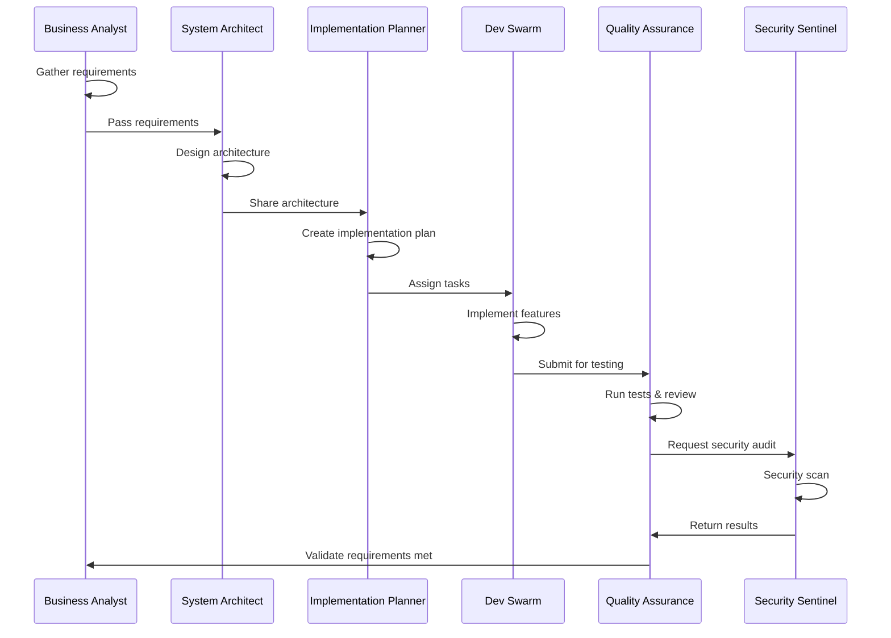

# 🤖 Multi-Agent SDLC Framework

> **A production-ready, enterprise-grade framework for agent-driven software development**

[](https://github.com/mohitkesarwani/multi-agent-sdlc-framework/actions)
[](https://github.com/mohitkesarwani/multi-agent-sdlc-framework/actions)
[](https://opensource.org/licenses/MIT)

## 📋 Table of Contents
- [Introduction](#introduction)
- [Agent-Driven Development](#agent-driven-development)
- [Quick Start](#quick-start)
- [Features](#features)
- [Directory Structure](#directory-structure)
- [How Agents Work](#how-agents-work)
- [Installation](#installation)
- [Usage](#usage)
- [Docker Support](#docker-support)
- [CI/CD](#cicd)
- [Documentation](#documentation)
- [Contributing](#contributing)
- [License](#license)

## 🎯 Introduction

The **Multi-Agent SDLC Framework** is a revolutionary approach to software development that leverages autonomous AI agents to automate and optimize the entire Software Development Life Cycle (SDLC). This framework provides a complete, production-ready template that can be cloned and customized for any project.

### Why Multi-Agent SDLC?

- ⚡ **Accelerated Development**: AI agents work in parallel to speed up development cycles
- 🎯 **Consistent Quality**: Automated quality checks ensure enterprise-grade standards
- 🔒 **Security First**: Built-in security agents monitor and enforce best practices
- 📊 **Data-Driven Decisions**: Agents analyze and optimize based on metrics
- 🔄 **Continuous Improvement**: Iterative feedback loops enhance code quality
- 🌐 **Full-Stack Coverage**: Agents handle frontend, backend, database, and infrastructure

## 🤖 Agent-Driven Development

This framework employs **six specialized AI agents** that collaborate throughout the SDLC:

### 1. 📝 Requirement Agent
- Gathers and analyzes business requirements
- Creates user stories and acceptance criteria
- Identifies technical constraints and dependencies

### 2. 🏗️ System Architect
- Designs system architecture and component interactions
- Defines data models and API contracts
- Ensures scalability and maintainability

### 3. 📋 Implementation Planner
- Breaks down features into actionable tasks
- Estimates effort and identifies risks
- Creates implementation roadmaps

### 4. 👨‍💻 FullStack Dev Swarm
- Implements features across frontend and backend
- Writes clean, maintainable code
- Follows best practices and design patterns

### 5. 🧪 Quality Assurance
- Creates comprehensive test suites
- Performs code reviews and quality checks
- Validates functionality against requirements

### 6. 🛡️ Security Sentinel
- Conducts security audits and vulnerability scans
- Enforces security best practices
- Monitors for security issues continuously

## 🚀 Quick Start

Get started in under 5 minutes:

```bash
# 1. Clone the repository
git clone https://github.com/mohitkesarwani/multi-agent-sdlc-framework.git
cd multi-agent-sdlc-framework

# 2. Run setup script
./scripts/setup.sh

# 3. Update environment variables
nano src/backend/.env  # Add your configuration

# 4. Initialize backend
./scripts/init-backend.sh

# 5. Start with Docker Compose
docker-compose -f infrastructure/docker/docker-compose.yml up
```

Or start services individually:
```bash
# Backend
cd src/backend && npm run dev

# Frontend (in another terminal)
cd src/frontend && npm run dev
```

🎉 Visit `http://localhost:3000` to see your application!

## ✨ Features

### 🎨 Frontend (React + Vite)
- ⚛️ React 17 with functional components and hooks
- 🎨 Tailwind CSS for modern, responsive UI
- 🔄 React Router for client-side routing
- 🌐 API service layer with axios
- 🔐 JWT authentication with protected routes

### 🔧 Backend (Node.js + Express)
- 🚀 Express.js REST API
- 🗄️ MongoDB with Mongoose ODM
- 🔒 JWT-based authentication & authorization
- 🛡️ Security middleware (Helmet, CORS, rate limiting)
- ✅ Input validation with Zod
- 📝 Structured logging with Winston
- 🔄 Error handling middleware

### 🗄️ Database
- 📊 MongoDB for flexible document storage
- 🏗️ Pre-defined schemas for common entities
- 🔗 Relationship management
- 📈 Indexing for performance

### 🐳 DevOps & Infrastructure
- 🐳 Docker & Docker Compose support
- 🔄 CI/CD pipelines with GitHub Actions
- 🧪 Automated testing (unit, integration, E2E)
- 🔍 Code quality checks (ESLint, Prettier)
- 🛡️ Security scanning (CodeQL, Trivy, TruffleHog)
- 📦 Deployment automation

### 🤖 Agent Orchestration
- 🎯 Configurable agent roles and workflows
- 📋 Task assignment and tracking
- 💬 Inter-agent communication protocols
- 📊 Decision logging and audit trails
- 🔄 Iteration management

## 📁 Directory Structure

```
multi-agent-sdlc-framework/
├── 📂 .agent-config/           # Agent configuration files
│   ├── agent-roles.json        # Agent definitions and capabilities
│   ├── prompts.json            # Prompt templates for agents
│   ├── workflows.json          # Workflow definitions
│   └── checklist.json          # Quality & compliance checklists
│
├── 📂 .github/                 # GitHub configuration
│   └── workflows/              # CI/CD workflows
│       ├── test.yml            # Automated testing
│       ├── lint.yml            # Code quality checks
│       ├── security.yml        # Security scanning
│       └── deploy.yml          # Deployment pipeline
│
├── 📂 docs/                    # Documentation
│   ├── AGENT_INSTRUCTIONS.md   # Guide for AI agents
│   ├── AGENT_FRAMEWORK.md      # Framework architecture
│   ├── TEMPLATE_USAGE.md       # How to use as template
│   ├── REQUIREMENTS_TEMPLATE.md # Requirements gathering
│   ├── ARCHITECTURE_TEMPLATE.md # Architecture docs
│   ├── SECURITY_CHECKLIST.md   # Security requirements
│   └── QUICK_START.md          # Quick start guide
│
├── 📂 infrastructure/          # Infrastructure as code
│   └── docker/                 # Docker configuration
│       ├── Dockerfile.backend  # Backend container
│       ├── Dockerfile.frontend # Frontend container
│       ├── docker-compose.yml  # Local dev setup
│       └── nginx.conf          # Nginx configuration
│
├── 📂 scripts/                 # Utility scripts
│   ├── setup.sh                # Initial setup
│   ├── init-backend.sh         # Backend initialization
│   ├── install-deps.sh         # Install dependencies
│   ├── migrate.sh              # Database migrations
│   └── README.md               # Scripts documentation
│
├── 📂 src/                     # Source code
│   ├── 📂 backend/             # Backend API
│   │   ├── config/             # Configuration files
│   │   ├── controllers/        # Route controllers
│   │   ├── middleware/         # Express middleware
│   │   ├── models/             # Mongoose models
│   │   ├── routes/             # API routes
│   │   ├── services/           # Business logic
│   │   ├── package.json        # Backend dependencies
│   │   ├── .env.example        # Environment template
│   │   └── server.js           # Entry point
│   │
│   └── 📂 frontend/            # Frontend application
│       ├── components/         # React components
│       ├── pages/              # Page components
│       ├── context/            # React context
│       ├── services/           # API services
│       ├── styles/             # CSS files
│       └── main.jsx            # Entry point
│
├── 📜 orchestrator.js          # Agent orchestration engine
├── 📜 package.json             # Root dependencies
├── 📜 .env.example             # Environment template
└── 📜 README.md                # This file
```

## 🔄 How Agents Work

### Workflow Example: New Feature Development



### Agent Communication Protocol

Agents communicate through a **centralized knowledge base** (`PROJECT_KNOWLEDGE.md`) that serves as the single source of truth. Each agent:

1. **Reads** the current state and previous decisions
2. **Performs** its specialized tasks
3. **Writes** results, decisions, and next steps
4. **Triggers** the next agent in the workflow

### Configuration

Agents are configured through JSON files in `.agent-config/`:
- **agent-roles.json**: Defines agent capabilities and responsibilities
- **prompts.json**: Contains prompt templates for different tasks
- **workflows.json**: Specifies execution flows and decision points
- **checklist.json**: Quality gates and validation criteria

## 💻 Installation

### Prerequisites

- **Node.js** 16+ and npm 8+
- **MongoDB** 4.4+ (or use Docker)
- **Docker** (optional, for containerized development)
- **Git**

### Step-by-Step Installation

1. **Clone the repository**
   ```bash
   git clone https://github.com/mohitkesarwani/multi-agent-sdlc-framework.git
   cd multi-agent-sdlc-framework
   ```

2. **Run the setup script**
   ```bash
   ./scripts/setup.sh
   ```
   This will:
   - Check prerequisites
   - Install all dependencies
   - Create `.env` files
   - Set up directories
   - Configure Git hooks

3. **Configure environment variables**
   ```bash
   # Edit backend .env
   nano src/backend/.env
   
   # Update these critical values:
   # - MONGODB_URI
   # - JWT_SECRET
   # - JWT_REFRESH_SECRET
   ```

4. **Initialize the backend**
   ```bash
   ./scripts/init-backend.sh
   ```
   Optionally create an admin user when prompted.

5. **Verify installation**
   ```bash
   # Test backend
   cd src/backend && npm test
   
   # Test frontend
   cd src/frontend && npm test
   ```

## 🎮 Usage

### Development Mode

**Option 1: Using Docker Compose (Recommended)**
```bash
docker-compose -f infrastructure/docker/docker-compose.yml up
```
- Backend: `http://localhost:5000`
- Frontend: `http://localhost:3000`
- MongoDB: `localhost:27017`

**Option 2: Running Services Individually**
```bash
# Terminal 1: Start MongoDB (if not using Docker)
mongod

# Terminal 2: Start backend
cd src/backend
npm run dev

# Terminal 3: Start frontend
cd src/frontend
npm run dev
```

### Production Mode

```bash
# Build frontend
cd src/frontend && npm run build

# Start backend in production mode
cd src/backend
NODE_ENV=production npm start
```

### Using with AI Agents

1. **Configure agents** in `.agent-config/`
2. **Run the orchestrator**:
   ```bash
   node orchestrator.js
   ```
3. **Monitor** agent activities in logs
4. **Review** `PROJECT_KNOWLEDGE.md` for decisions and progress

## 🐳 Docker Support

### Docker Commands

```bash
# Build images
docker-compose -f infrastructure/docker/docker-compose.yml build

# Start services
docker-compose -f infrastructure/docker/docker-compose.yml up -d

# View logs
docker-compose -f infrastructure/docker/docker-compose.yml logs -f

# Stop services
docker-compose -f infrastructure/docker/docker-compose.yml down

# Remove volumes (reset database)
docker-compose -f infrastructure/docker/docker-compose.yml down -v
```

### Multi-Stage Builds

The Dockerfiles use multi-stage builds for optimized production images:
- **Backend**: Node.js Alpine image (~50MB)
- **Frontend**: Nginx Alpine image (~25MB)

## 🔄 CI/CD

The framework includes comprehensive CI/CD pipelines:

### Automated Workflows

- **Testing**: Runs on every push and PR
  - Unit tests
  - Integration tests
  - Code coverage reporting

- **Linting**: Code quality checks
  - ESLint for code style
  - Prettier for formatting
  - Complexity analysis

- **Security**: Automated security scanning
  - CodeQL analysis
  - Dependency vulnerability scanning
  - Secret scanning
  - Container security

- **Deployment**: Automated deployments
  - Staging on commits to main
  - Production on version tags
  - Rollback support

### Running CI Checks Locally

```bash
# Run tests
npm test

# Run linting
npm run lint

# Run security checks
npm audit

# Run all checks
npm run ci
```

## 📚 Documentation

Comprehensive documentation is available in the `docs/` directory:

- **[Quick Start Guide](docs/QUICK_START.md)** - Get started in 5 minutes
- **[Agent Instructions](docs/AGENT_INSTRUCTIONS.md)** - Guide for AI agents
- **[Agent Framework](docs/AGENT_FRAMEWORK.md)** - Technical architecture
- **[Template Usage](docs/TEMPLATE_USAGE.md)** - Using as a template
- **[Requirements Template](docs/REQUIREMENTS_TEMPLATE.md)** - Gathering requirements
- **[Architecture Template](docs/ARCHITECTURE_TEMPLATE.md)** - Architecture docs
- **[Security Checklist](docs/SECURITY_CHECKLIST.md)** - Security requirements

### API Documentation

API endpoints are documented in `docs/ARCHITECTURE_TEMPLATE.md`. Key endpoints:

- `POST /api/auth/register` - User registration
- `POST /api/auth/login` - User login
- `GET /api/auth/me` - Get current user
- `GET /api/projects` - List projects
- `POST /api/projects` - Create project
- And more...

## 🤝 Contributing

We welcome contributions from the community! Here's how to get started:

### Contributing Process

1. **Fork** the repository
2. **Create** a feature branch
   ```bash
   git checkout -b feature/YourAmazingFeature
   ```
3. **Make** your changes following our coding standards
4. **Test** your changes thoroughly
   ```bash
   npm test
   npm run lint
   ```
5. **Commit** with descriptive messages
   ```bash
   git commit -m 'Add: YourAmazingFeature with tests'
   ```
6. **Push** to your fork
   ```bash
   git push origin feature/YourAmazingFeature
   ```
7. **Open** a Pull Request

### Coding Standards

- Follow ESLint configuration
- Write tests for new features
- Update documentation
- Add comments for complex logic
- Follow security best practices

### Running Tests

```bash
# Run all tests
npm test

# Run with coverage
npm test -- --coverage

# Run specific test file
npm test -- path/to/test.js
```

## 📄 License

This project is licensed under the **MIT License** - see the [LICENSE](LICENSE) file for details.

---

## 🌟 Star Us!

If you find this project useful, please consider giving it a star ⭐ on GitHub!

## 📧 Contact

For questions, issues, or contributions, please open an issue on GitHub.

---

**Built with ❤️ by the Multi-Agent SDLC community**