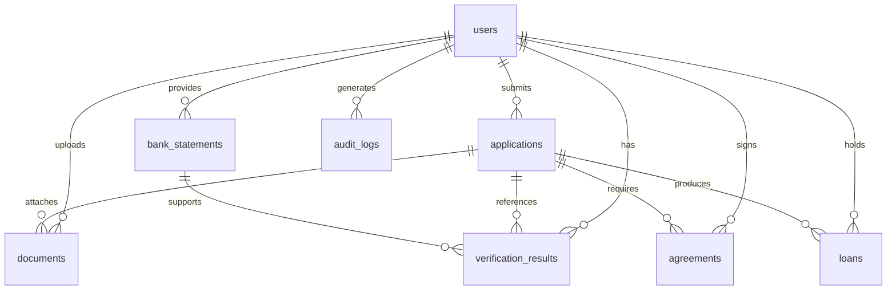
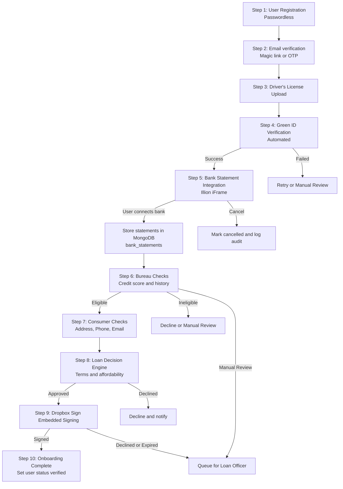

# 📚 PROJECT KNOWLEDGE - Consumer Lending App (Australian Market)

**Last Updated:** 8 February 2026
**Framework Version:** 1.0.0
**Status:** Requirements Defined for Development

---

## 1️⃣ BUSINESS REQUIREMENTS

### Vision

Build a fast, mobile-first Australian consumer lending platform that enables compliant, near real-time credit decisions using secure passwordless onboarding, automated identity and credit verification, bank statement assessment, and embedded e-signature, while maintaining strong auditability and privacy-by-design controls.

### Target Market

Australian consumers seeking small to medium personal loans (unsecured) with digital onboarding, including:

* Salaried and wage earners (PAYG) with stable income
* Gig economy and casual workers with variable income (requires stronger bank statement assessment)
* Borrowers needing rapid approval and transparent repayment schedules
* Users who prefer digital ID checks, bank statement sharing, and online signing over branch-based processes

### Key Features

* [ ] Passwordless authentication and onboarding (magic link primary, OTP fallback)
* [ ] Customer profile creation with onboarding state machine (draft → verified → active)
* [ ] Loan application journey with clear statuses and SLAs
* [ ] Illion BankStatements BankScrape iFrame for bank statement retrieval and assessment
* [ ] Bank statement parsing and storage (balances, transactions, account details)
* [ ] Driver’s license upload (image) and secure storage (encryption at rest)
* [ ] Green ID identity verification against driver’s license data sources
* [ ] Credit bureau checks integration (Australia) with result normalization
* [ ] Consumer checks (address validation, phone verification, email verification)
* [ ] Embedded e-signature for loan agreement signing (Dropbox Sign, formerly HelloSign)
* [ ] Loan dashboard (current loans, repayment schedule, statements, status history)
* [ ] Admin and loan officer portal (queue management, manual review, decision overrides)
* [ ] Compliance audit trail (immutable-ish logs, event sourcing pattern where needed)
* [ ] Consent capture and management (bank statement consent, bureau consent, e-sign consent)
* [ ] Data retention and deletion workflows (Privacy Act aligned, configurable)
* [ ] Fraud and anomaly flags (mismatched identity, velocity checks, device and session risk)
* [ ] Regulatory reporting hooks (Responsible Lending assessment artifacts, audit exports)
* [ ] Secure webhook handling (verification callbacks, signing callbacks)
* [ ] Monitoring and alerting for integration failures, SLA breaches, and security events

### Regulatory Compliance

Core Australian obligations to design for:

* National Consumer Credit Protection Act 2009 (NCCP) and responsible lending obligations (credit licensee responsibilities, suitability assessment evidence retention)
* ASIC regulatory guidance for responsible lending (assessment process, inquiries, verification, record keeping)
* Privacy Act 1988 (Cth) and Australian Privacy Principles (collection limitation, consent, use and disclosure, access and correction, security)
* Notifiable Data Breaches scheme (preparedness, incident logging, breach assessment, notification workflow)
* AML/CTF Act and Rules (risk-based KYC/verification expectations where applicable to product and business model)
* Australian Consumer Law (clear disclosures, fairness, complaint handling)
* Accessibility expectations (WCAG-aligned practices) to support Disability Discrimination Act obligations in digital channels
* Cyber security controls aligned to the Essential Eight as a baseline

Reference endpoints and vendor documentation are captured in the Integration Requirements section.

---

### User Stories (BDD Format)

**Story 1: Passwordless registration**

* **Given** a new customer visits the app
* **When** they enter their email and request a magic link
* **Then** the system sends a time-limited link
* **And** creates a user profile in `users` with onboarding status `draft`

**Story 2: Magic link verification**

* **Given** the customer clicks the magic link within the allowed time window
* **When** the backend validates the token and device/session fingerprint
* **Then** the customer is authenticated
* **And** onboarding status becomes `email_verified`

**Story 3: OTP fallback**

* **Given** the customer cannot access the magic link
* **When** they request an OTP and submit the correct OTP
* **Then** they are authenticated
* **And** the OTP attempt is recorded in `audit_logs`

**Story 4: Driver’s license upload**

* **Given** the customer is authenticated
* **When** they upload driver’s license images
* **Then** the system stores an encrypted document record in `documents`
* **And** sets `documents.verificationStatus` to `pending`

**Story 5: Green ID verification**

* **Given** a driver’s license document is uploaded
* **When** the system submits identity data to Green ID
* **Then** a record is created in `verification_results`
* **And** the customer sees `identity_check` status as `pending` until completion

**Story 6: Bank statement collection via iFrame**

* **Given** identity verification is successful or allowed to proceed by policy
* **When** the customer completes Illion BankScrape iFrame flow
* **Then** bank statement data is stored in `bank_statements`
* **And** consent artifacts are recorded in `audit_logs`

**Story 7: Bureau checks**

* **Given** the customer has provided consent for credit checks
* **When** the system requests a bureau check
* **Then** the system stores normalized outputs in `verification_results`
* **And** the application moves to `credit_assessed`

**Story 8: Decisioning and offer generation**

* **Given** identity, bank statement, and bureau results are available
* **When** the decision engine calculates eligibility and terms
* **Then** the system creates an offer and updates `applications.status` to `approved` or `manual_review`

**Story 9: Embedded agreement signing**

* **Given** the application is approved
* **When** the customer signs the agreement via embedded signing
* **Then** the system stores `agreements.status = signed`
* **And** onboarding status becomes `verified`

**Story 10: Loan officer manual review**

* **Given** an application is flagged as `manual_review`
* **When** a loan officer reviews verification evidence and adds notes
* **Then** the officer can approve or decline
* **And** all actions are recorded in `audit_logs` with actor and reason codes

---

## 2️⃣ SCHEMA DESIGN (MongoDB Collections)

### Mermaid ERD (Conceptual)



### Collection Definitions

#### `users`

Key fields:

* `_id`: ObjectId
* `email`: string (unique, indexed)
* `phone`: string (optional, indexed)
* `fullName`: string
* `dob`: date
* `residentialAddress`: object `{ line1, line2, suburb, state, postcode, country }`
* `onboardingStatus`: string enum
  `draft | email_verified | id_uploaded | id_verified | bank_connected | credit_assessed | agreement_signed | verified | rejected`
* `consents`: object `{ creditCheckConsentAt, bankStatementConsentAt, esignConsentAt, privacyConsentAt, termsConsentAt }`
* `riskFlags`: array of strings
* `createdAt`: date
* `updatedAt`: date

Relationships:

* `users._id` referenced by `applications.userId`, `documents.userId`, `bank_statements.userId`, `verification_results.userId`, `agreements.userId`, `loans.userId`, `audit_logs.userId`

Verification flags:

* `onboardingStatus`
* `riskFlags`

#### `applications`

Key fields:

* `_id`: ObjectId
* `userId`: ObjectId (indexed)
* `requestedAmount`: number
* `purpose`: string
* `employment`: object `{ type, employerName, incomeFrequency, declaredIncome }`
* `status`: string enum
  `draft | submitted | identity_pending | identity_failed | bank_pending | bureau_pending | consumer_checks_pending | decision_pending | approved | declined | manual_review | cancelled`
* `decision`: object `{ outcome, score, reasons, maxApprovedAmount, approvedAPR, termMonths }`
* `manualReview`: object `{ required, queue, assignedTo, notes }`
* `createdAt`: date
* `updatedAt`: date

Relationships:

* `applications._id` referenced by `documents.applicationId`, `verification_results.applicationId`, `agreements.applicationId`, `loans.applicationId`

#### `documents`

Key fields:

* `_id`: ObjectId
* `userId`: ObjectId (indexed)
* `applicationId`: ObjectId (optional, indexed)
* `type`: string enum `drivers_license | payslip | bank_statement_pdf | other`
* `fileName`: string
* `mimeType`: string
* `sizeBytes`: number
* `storage`: object `{ provider, bucket, key, encrypted }`
* `encryption`: object `{ algorithm, keyId, ivRef }`
* `verificationStatus`: string enum `pending | verified | failed | manual_review`
* `verificationProvider`: string enum `greenid | manual | none`
* `extractedFields`: object (optional)
* `createdAt`: date
* `updatedAt`: date

#### `bank_statements`

Key fields:

* `_id`: ObjectId
* `userId`: ObjectId (indexed)
* `applicationId`: ObjectId (indexed)
* `provider`: string enum `illion_bankstatements`
* `sessionRef`: string (iFrame session or guid)
* `accounts`: array of objects `{ accountName, accountType, bsb, accountNumberMasked, currency }`
* `balances`: array of objects `{ accountRef, asAt, available, current }`
* `transactions`: array of objects `{ accountRef, date, description, amount, balance, category }`
* `period`: object `{ from, to }`
* `raw`: object (optional, minimized, encrypted or redacted where needed)
* `status`: string enum `pending | received | failed | cancelled`
* `createdAt`: date
* `updatedAt`: date

Verification flags:

* `status`

#### `verification_results`

Key fields:

* `_id`: ObjectId
* `userId`: ObjectId (indexed)
* `applicationId`: ObjectId (indexed)
* `type`: string enum `greenid_identity | bureau_credit | consumer_checks | bank_statement_analysis`
* `provider`: string enum `greenid | equifax | experian | illion | other`
* `status`: string enum `pending | verified | failed | manual_review`
* `summary`: object `{ outcome, score, reasons }`
* `details`: object (provider response normalized)
* `fraudFlags`: array of strings
* `createdAt`: date
* `updatedAt`: date

#### `agreements`

Key fields:

* `_id`: ObjectId
* `userId`: ObjectId (indexed)
* `applicationId`: ObjectId (indexed)
* `provider`: string enum `dropbox_sign`
* `templateId`: string
* `signatureRequestId`: string
* `signerSignatureId`: string
* `signUrl`: string (short-lived, do not persist long-term unless encrypted and expiring)
* `status`: string enum `draft | sent | viewed | signed | declined | expired | cancelled`
* `signedAt`: date (optional)
* `pdfUrl`: string (optional, storage reference preferred)
* `createdAt`: date
* `updatedAt`: date

#### `loans`

Key fields:

* `_id`: ObjectId
* `userId`: ObjectId (indexed)
* `applicationId`: ObjectId (indexed)
* `principal`: number
* `apr`: number
* `termMonths`: number
* `repaymentSchedule`: array `{ dueDate, amount, principalPortion, interestPortion, status }`
* `status`: string enum `pending_disbursement | active | in_arrears | closed | written_off`
* `disbursement`: object `{ amount, date, method, reference }`
* `repayments`: array `{ date, amount, method, reference, status }`
* `createdAt`: date
* `updatedAt`: date

#### `audit_logs`

Key fields:

* `_id`: ObjectId
* `userId`: ObjectId (optional, indexed)
* `applicationId`: ObjectId (optional, indexed)
* `actor`: object `{ type: "system|user|admin|loan_officer|compliance", actorId, ip, userAgent }`
* `eventType`: string (indexed)
* `event`: object (structured payload, avoid sensitive raw data)
* `hash`: string (optional, for tamper-evidence chaining)
* `createdAt`: date

---

## 3️⃣ INTEGRATION REQUIREMENTS

### A) Illion Bank Scrape Integration

* **Service:** Illion BankStatements (BankScrape style embed via bankstatements.com.au iFrame plus API options)
* **Purpose:** Retrieve bank statement data for financial assessment and responsible lending evidence
* **What we need to capture:**

  * Bank account balances
  * Transaction history (last 3 to 6 months minimum, optionally up to 12 months)
  * Account type, BSB, masked account number
  * Statement period coverage and completeness
* **iFrame Endpoint (Australia):**

```text
https://www.bankstatements.com.au/iframe/start/{REFERRAL_CODE}
```

* **API Base URLs:**

```text
Production: https://www.bankstatements.com.au/api/v1/
Test:       https://test.bankstatements.com.au/api/v1/
```

* **Authentication:**

  * Server-to-server API key via `X-API-KEY` header (BankStatements API) ([BankStatements API][1])
* **Data flow:**

  * React loads iFrame using referral code and optional unique identifier
  * Completion triggers statement delivery to configured delivery endpoint or retrieval via API
  * Backend normalizes and stores into `bank_statements`
* **Error handling strategies:**

  * Failed connection or bank unavailable: show retry with backoff and allow re-init session
  * Expired session: invalidate sessionRef and issue new initiation
  * User cancellation: mark `bank_statements.status = cancelled` and keep audit evidence
  * MFA and CAPTCHA flows: support stateful continuation and prompt loops when using API-based flows ([BankStatements API][1])
* **Compliance and security:**

  * Encrypt sensitive payload segments in `bank_statements.raw`
  * Store only masked account numbers
  * Strict TLS for all calls
  * Consent capture: timestamp, versioned consent text, and iFrame session reference
* **Implementation notes:**

  * Prefer iFrame for fastest UI integration, optionally migrate to API for deeper workflow control
  * Pricing reference for submission-based plans is available publicly ([Bank Statements][2])

### B) Green ID Verification (Driver’s License)

* **Service:** GBG greenID (Australia)
* **Purpose:** Verify identity against driver’s license and other sources, reduce fraud, support KYC expectations
* **Upload process:**

  * Customer uploads license images
  * Store encrypted reference in `documents`
  * Extract minimal metadata needed for verification (avoid storing full OCR if not required)
* **What we need to verify:**

  * Name match
  * DOB match
  * License number format and validity
  * Expiry check
  * Source match confidence and reason codes
* **API Endpoint (recommended): greenID RESTful v6**

```text
Production: https://au.greenid.gbg.com/greenid/v6
Test:       https://test-au.greenid.gbg.com/greenid/v6
```

* **Alternative endpoints (legacy SOAP v5):**

```text
Production WSDL: https://au.vixverify.com/Registrations-Registrations/DynamicFormsServiceV5?wsdl
Test WSDL:       https://test-au.vixverify.com/Registrations-Registrations/DynamicFormsServiceV5?wsdl
```

* **Authentication:**

  * Vendor-issued credentials and token scheme per greenID API access model (REST v6) ([vixverify.atlassian.net][3])
* **Data storage:**

  * License images: store encrypted at rest, preferably object storage with envelope encryption, store only references in MongoDB
  * Verification outputs: store in `verification_results` with `status` and `summary`
* **Error handling strategies:**

  * OCR failures: retry once, then route to `manual_review`
  * Expired license: hard fail with reason code and allow alternative ID path if supported
  * Fraud flags or mismatch: `manual_review` plus enhanced checks (bureau + consumer checks)
  * Vendor outage: circuit breaker, queue verification job, notify operations
* **Fraud and risk flags:**

  * Multiple attempts in short time
  * Mismatch across name/DOB/address between user input, ID, and bureau header

### C) Bureau Checks Integration (VEDA/Equifax/Experian Australia)

* **Service options:** Equifax Australia API Connect, Experian Australia bureau services (availability depends on commercial agreement)
* **Purpose:** Retrieve credit score, file summary, defaults, and repayment behavior signals for decisioning and responsible lending evidence
* **Equifax Developer Center (Australia):**

```text
https://developer.equifax.com.au/
```

* **Equifax API Connect product page (Australia):**

```text
https://www.equifax.com.au/api-connect
```

* **Authentication:**

  * Contracted credentials, typically API keys and client authentication flows (varies by product)
* **Data captured (normalized):**

  * Credit score and score band
  * Defaults and serious credit infringements flags (where applicable)
  * Enquiries summary
  * Repayment history indicators (product-dependent)
  * Bureau header match outcomes (name, DOB, address confidence)
* **Results storage:**

  * Store in `verification_results` with:

    * `type = bureau_credit`
    * `provider = equifax | experian | other`
    * `details` normalized
* **Compliance:**

  * Record consent and permissible purpose
  * Minimize data persisted, store only what is needed for decisioning and audit defense
  * Restrict access (RBAC) and log all access in `audit_logs`
* **Error handling strategies:**

  * No hit or thin file: proceed with bank-statement-heavy assessment and apply policy caps
  * Vendor timeout: retry with exponential backoff, then `manual_review`
  * Identity mismatch: block automated approval and require manual review
* **Accessible alternative (not a bureau):**

  * If bureau access is not yet contracted, start with bank statement decisioning and consumer checks, then phase in bureau once agreements are in place

### D) Consumer Checks Integration

* **Service scope:** address validation, phone verification, email verification
* **Purpose:** Validate contactability and address plausibility, reduce fraud and improve collections readiness
* **Address validation (Australia):**

  * Open-source and self-hostable option using G-NAF-based tooling:

```text
https://github.com/mountain-pass/addressr
```

* **Phone verification:**

  * Primary: Twilio Verify (global, reliable), or an equivalent provider that supports AU SMS
  * Open-source alternative: none that provides carrier-grade verification, only basic formatting validation
* **Email verification:**

  * Primary: mailbox verification service (paid) or lightweight DNS and SMTP checks
  * Open-source baseline: syntax + DNS MX lookup only (not deliverability guarantees)
* **Results storage:**

  * Store combined result in `verification_results` with `type = consumer_checks`
* **Error handling strategies:**

  * Address mismatch: prompt user to correct or provide evidence, route to manual review if persistent
  * SMS delivery issues: fallback to voice OTP or email OTP
  * Email bounce risk: require secondary contact method before disbursement

### E) HelloSign Agreement Integration

* **Service:** Dropbox Sign API (formerly HelloSign), embedded signing
* **Purpose:** Collect e-signature on loan agreement without leaving the app
* **Workflow:**

  1. After all checks pass, generate loan terms document (template + merge fields)
  2. Create signature request using embedded signing mode
  3. Embed signing in React
  4. Webhook callback updates `agreements` and `users.onboardingStatus`
* **API Base URL:**

```text
https://api.hellosign.com/v3
```

* **Embedded signing flow docs:**

```text
https://developers.hellosign.com/docs/walkthroughs/embedded-signing
```

* **Authentication:**

  * API key in Authorization header (Basic auth pattern supported by vendor SDKs)
* **Document template:**

  * Maintain versioned templates with variable placeholders:

    * borrower name, address
    * loan principal, APR, term
    * repayment schedule summary
    * fees and disclosures
* **Callback handling:**

  * Webhook signature verification
  * Idempotency keys for repeated webhook deliveries
* **Error handling strategies:**

  * Declined signature: set `agreements.status = declined`, application moves to `manual_review` or `declined`
  * Session timeout: regenerate sign URL using `signature_id`, resume flow
  * Revocation: cancel request and re-issue with updated terms
* **Compliance and security:**

  * Store signed PDF in encrypted storage, keep only storage references in MongoDB
  * Audit trail for who signed, when, IP, and document version

---

## 4️⃣ AUTHENTICATION & SECURITY

### Passwordless Authentication

* **Primary method:** Magic link via email
* **Fallback:** OTP via SMS (or email OTP if SMS is unavailable)
* **Optional future:** Passkeys (WebAuthn) for returning users once baseline is stable

Recommended flow:

1. `POST /api/auth/request-magic-link` creates short-lived token and sends email link
2. `POST /api/auth/verify-magic-link` exchanges token for session JWT
3. OTP fallback endpoints for recovery and delivery issues

Token and session rules:

* Magic link token TTL: 10 to 15 minutes
* One-time use tokens (invalidate after first success)
* Rate limits: per IP, per email, per device fingerprint
* Device and session binding: store `sessionId`, `ip`, `uaHash` and rotate refresh tokens

### Data Security

* Encryption at rest:

  * Driver’s license images: envelope encryption, rotate keys, store in object storage with KMS, store only references in MongoDB
  * Bank statement raw data: encrypt sensitive subdocuments, store normalized aggregates separately
* Data in transit:

  * TLS 1.3 preferred, enforce HSTS, disable weak ciphers
* Secrets management:

  * Environment variables injected at deploy-time, never stored in repo
  * Rotate third-party API keys, use separate test and prod credentials
* Payment data:

  * If collecting repayments via cards, avoid storing PAN and use a PCI-compliant payments provider with tokenization
  * If repayment method is bank debit, store only tokens and mandates where supported
* Webhook security:

  * Verify webhook signatures
  * Enforce allowlist of vendor IPs where feasible
  * Idempotency and replay protection

### Privacy

* Australian Privacy Principles aligned controls:

  * Data minimization: store only what is needed
  * Purpose limitation: use bureau and identity data only for lending decisioning and compliance
  * Access controls and logging: strict RBAC, audit every access to verification data
* Data retention policies:

  * Configurable per data class:

    * Verification artifacts: retained for compliance period or policy-defined term
    * Bank statements raw: shortest retention feasible, keep derived metrics longer
* User data deletion workflow:

  * Verify identity before deletion
  * Soft delete user profile, hard delete eligible data after retention windows
  * Preserve minimal audit entries where legally required, with PII redaction where permitted

### Key Configuration Snippets

#### Environment variables

```bash
# Core
NODE_ENV=production
APP_BASE_URL=https://app.example.com
API_BASE_URL=https://api.example.com
JWT_SECRET=replace_me
JWT_REFRESH_SECRET=replace_me

# MongoDB
MONGODB_URI=mongodb+srv://...

# BankStatements (Illion)
BANKSTATEMENTS_API_BASE=https://www.bankstatements.com.au/api/v1
BANKSTATEMENTS_API_KEY=replace_me
BANKSTATEMENTS_REFERRAL_CODE=YOUR_REFERRAL_CODE

# GBG greenID
GREENID_BASE_URL=https://au.greenid.gbg.com/greenid/v6
GREENID_CLIENT_ID=replace_me
GREENID_CLIENT_SECRET=replace_me

# Bureau (example)
EQUIFAX_BASE_URL=https://developer.equifax.com.au
EQUIFAX_CLIENT_ID=replace_me
EQUIFAX_CLIENT_SECRET=replace_me

# Dropbox Sign (HelloSign)
HELLOSIGN_API_BASE=https://api.hellosign.com/v3
HELLOSIGN_API_KEY=replace_me
HELLOSIGN_WEBHOOK_SECRET=replace_me

# Encryption
DATA_ENCRYPTION_KEY_ID=kms-key-id-or-vault-ref
```

#### Express security baseline

```js
// server/security.js
import helmet from "helmet";
import rateLimit from "express-rate-limit";

export function applySecurity(app) {
  app.use(helmet());

  app.use(
    "/api/auth",
    rateLimit({
      windowMs: 15 * 60 * 1000,
      max: 50,
      standardHeaders: true,
      legacyHeaders: false,
    })
  );
}
```

---

## 5️⃣ VERIFICATION WORKFLOW (Step-by-Step)



---

## 6️⃣ API ENDPOINTS

### Authentication Endpoints

* `POST /api/auth/request-magic-link`

  * Body: `{ email }`
  * Response: `{ requestId }`
  * Errors: rate-limited, invalid email, blocked domain
* `POST /api/auth/verify-magic-link`

  * Body: `{ token }`
  * Response: `{ accessToken, refreshToken, user }`
  * Errors: expired, already used, device mismatch
* `POST /api/auth/request-otp`

  * Body: `{ channel: "sms|email", destination }`
  * Response: `{ requestId }`
* `POST /api/auth/verify-otp`

  * Body: `{ requestId, code }`
  * Response: `{ accessToken, refreshToken, user }`

### Document Management Endpoints

* `POST /api/documents/upload-drivers-license`

  * Multipart form-data: `frontImage`, `backImage` (optional by state), metadata `{ licenseState }`
  * Response: `{ documentId, status: "pending" }`
  * Errors: file too large, invalid mime, malware scan fail
* `GET /api/documents/:documentId`

  * Response: `{ document }` (no raw file bytes, signed URL optional)
* `PUT /api/documents/:documentId/verify`

  * Purpose: manual override or trigger verification retry
  * Body: `{ action: "retry|manual_verify|manual_fail", reasonCode }`

### Bank Statement Endpoints

* `GET /api/illion/auth-token`

  * Purpose: provide iFrame config values (referral code, session identifiers)
  * Response: `{ referralCode, iframeUrl, sessionRef }`
* `POST /api/illion/callback`

  * Purpose: receive statement-ready notification or data payloads where configured
  * Body: vendor-defined
  * Security: webhook signature verification and idempotency
* `GET /api/bank-statements`

  * Query: `applicationId`
  * Response: `{ bankStatements: [] }`

### Verification Endpoints

* `GET /api/verification/green-id/:userId`

  * Response: `{ status, summary }`
* `GET /api/verification/bureau/:userId`

  * Response: `{ status, summary }`
* `GET /api/verification/consumer/:userId`

  * Response: `{ status, summary }`
* `GET /api/verification/status/:userId`

  * Response: `{ identity, bank, bureau, consumerChecks, overallStatus }`

### Agreement Endpoints

* `GET /api/agreements/create`

  * Query: `applicationId`
  * Response: `{ agreementId, signatureRequestId }`
* `GET /api/hellosign/auth-token`

  * Query: `agreementId`
  * Response: `{ signUrl, expiresAt }`
* `POST /api/hellosign/callback`

  * Purpose: signature completion webhook
  * Security: verify webhook
* `GET /api/agreements/:userId`

  * Response: `{ agreements: [] }`

### Loan Endpoints

* `POST /api/loans/calculate`

  * Body: `{ applicationId }`
  * Response: `{ offer: { amount, apr, termMonths, scheduleSummary } }`
* `GET /api/loans/my-loans`

  * Response: `{ loans: [] }`
* `PUT /api/loans/:loanId`

  * Body: `{ status, note }`
  * Security: admin or loan officer only

---

## 7️⃣ OPEN-SOURCE & COST-EFFECTIVE RECOMMENDATIONS

### Integration Comparison Table

| Integration     | Primary (AU-ready)                                                                     | Open-source or low-cost alternative                                                  | Cost signals                                                                          | Complexity     | Privacy and compliance fit             |
| --------------- | -------------------------------------------------------------------------------------- | ------------------------------------------------------------------------------------ | ------------------------------------------------------------------------------------- | -------------- | -------------------------------------- |
| Bank statements | Illion BankStatements (bankstatements.com.au iFrame + API) ([BankStatements API][1])   | None equivalent for direct bank scraping without commercial agreements               | Public pricing shows per submission charges for standard plans ([Bank Statements][2]) | Medium         | High (consent + encryption required)   |
| Identity (DL)   | GBG greenID v6 REST endpoints ([vixverify.atlassian.net][3])                           | Global doc verification APIs (not AU data source equivalent), manual review workflow | Quote-based                                                                           | Medium to High | High                                   |
| Bureau checks   | Equifax AU (API Connect / Developer Center) ([Equifax Developer Portal][4])            | None true open-source                                                                | Quote-based                                                                           | High           | High (strict consent and minimization) |
| Consumer checks | Addressr (G-NAF based) for address validation ([GitHub][5]) + SMS provider             | Addressr self-host for address, DNS-based email checks                               | Mostly infra cost for address, SMS per OTP                                            | Low to Medium  | Medium to High                         |
| E-sign          | Dropbox Sign embedded signing docs and API ([Dropbox Sign Developer Documentation][6]) | DocuSeal (self-host) for e-sign workflows                                            | Vendor plans vary by volume ([Dropbox Help Center][7])                                | Medium         | Medium to High                         |

#### Integration: Illion BankStatements

* Primary: Illion BankStatements via bankstatements.com.au iFrame and API

  * AU endpoints:

```text
iFrame: https://www.bankstatements.com.au/iframe/start/{REFERRAL_CODE}
API:    https://www.bankstatements.com.au/api/v1/
```

* Public pricing includes monthly plans and per submission pricing ([Bank Statements][2])
* Open-source alternative: None that replaces bank connectivity and data access legally and reliably
* Recommendation: Use iFrame first, then optionally add API-based client-side retrieval for deeper control ([BankStatements API][1])

#### Integration: Green ID Identity Verification

* Primary: GBG greenID REST v6

  * AU endpoints:

```text
Prod: https://au.greenid.gbg.com/greenid/v6
Test: https://test-au.greenid.gbg.com/greenid/v6
```

* Endpoints are published in vendor knowledge base ([vixverify.atlassian.net][3])
* Open-source alternative: None for authoritative AU ID source matching
* Recommendation: Use greenID v6 REST. Keep SOAP only if required by existing enterprise constraints

#### Integration: Bureau Checks

* Primary: Equifax Australia (API Connect / Developer Center) ([Equifax Developer Portal][4])
* Open-source alternative: None
* Cost comparison: contract-based, depends on product and volume
* Recommendation: Phase integration after baseline onboarding is stable. Build a provider-agnostic adapter layer so Equifax and Experian can be swapped

#### Integration: Consumer Checks

* Primary:

  * Address validation: Addressr (G-NAF based, self-hostable) ([GitHub][5])
  * Phone OTP: Twilio Verify or equivalent AU-capable provider
  * Email: DNS-based baseline plus optional paid mailbox verification
* Open-source alternative:

  * Address: Addressr (self-host) ([GitHub][5])
  * Phone: none true equivalent
  * Email: basic validation libraries + MX lookup only
* Recommendation: Use Addressr self-host for cost control and privacy, pair with a reliable OTP provider for phone verification

#### Integration: Dropbox Sign (HelloSign)

* Primary: Dropbox Sign API embedded signing

  * API:

```text
https://api.hellosign.com/v3
```

* Embedded signing workflow documented ([Dropbox Sign Developer Documentation][6])
* Open-source alternative:

  * DocuSeal (self-hosted e-sign) for cost control and data residency flexibility
* Cost comparison:

  * Vendor pricing is plan-based, varies by signature request volume ([Dropbox Help Center][7])
* Recommendation: Start with Dropbox Sign for faster go-live and mature webhooks, evaluate DocuSeal if volume cost or data residency becomes a blocker

---

## 8️⃣ TECHNOLOGY STACK CONFIRMATION

* **Backend:** Node.js, Express.js
* **Frontend:** React, Vite, Tailwind CSS
* **Database:** MongoDB

  * Collections: `users`, `applications`, `documents`, `bank_statements`, `verification_results`, `agreements`, `loans`, `audit_logs`
* **Authentication:** Passwordless

  * Magic link via email (primary)
  * OTP (fallback)
* **Document Storage:** Encrypted object storage preferred, MongoDB stores metadata and references
* **Integrations:**

  * Illion BankStatements (BankScrape iFrame + API) ([BankStatements API][1])
  * GBG greenID (REST v6) ([vixverify.atlassian.net][3])
  * Equifax AU (API Connect / Developer Center) ([Equifax Developer Portal][4])
  * Dropbox Sign embedded signing (HelloSign) ([Dropbox Sign Developer Documentation][6])
* **Testing:**

  * Backend: Jest
  * Frontend: Vitest
* **Deployment:** Docker containers
* **CI/CD:** GitHub Actions workflows

---

## 9️⃣ COMPLIANCE CHECKLIST (AUSTRALIAN MARKET)

* [ ] Responsible lending assessment artifacts captured and retained (NCCP aligned)
* [ ] ASIC responsible lending guidance incorporated into decisioning evidence and audit exports
* [ ] Privacy Act 1988 (Cth) and Australian Privacy Principles implemented
* [ ] Consent capture for credit checks and bank statement sharing recorded with timestamps
* [ ] Notifiable Data Breaches playbook integrated with audit logging and incident workflow
* [ ] AML/CTF obligations assessed for applicability and implemented where required
* [ ] Australian Consumer Law disclosures and complaints handling process supported
* [ ] Disability Discrimination Act aligned digital accessibility practices (WCAG-aligned)
* [ ] Data breach notification requirements supported via incident response workflow
* [ ] Essential Eight baseline controls mapped and implemented progressively
* [ ] Secure SDLC controls: dependency scanning, secret scanning, SAST, container scanning
* [ ] Data retention and deletion rules implemented and tested

---

## 🔟 SUCCESS CRITERIA & MILESTONES

### Phase 1: Authentication + Passwordless onboarding (Week 1-2)

Success criteria:

* Magic link login working end-to-end with rate limiting and audit logs
* OTP fallback available
* User onboarding status machine implemented

### Phase 2: Document upload + Green ID integration (Week 3-4)

Success criteria:

* Driver’s license upload with encrypted storage reference
* greenID verification results stored and surfaced
* Manual review pathway operational

### Phase 3: Illion bank scrape integration (Week 5-6)

Success criteria:

* iFrame embedded flow operational
* Bank statement data stored and normalized
* Cancellation and session expiry handled cleanly

### Phase 4: Bureau checks integration (Week 7-8)

Success criteria:

* Bureau adapter layer implemented
* Consent capture enforced
* Normalized bureau outcomes drive decisioning inputs

### Phase 5: Consumer checks integration (Week 9-10)

Success criteria:

* Address validation using G-NAF-based service
* Phone verification via OTP provider
* Email verification baseline checks implemented

### Phase 6: HelloSign agreement signing (Week 11-12)

Success criteria:

* Agreement template merging and signature request creation
* Embedded signing in React
* Webhook updates agreements and onboarding status reliably

### Phase 7: Testing + security audit (Week 13-14)

Success criteria:

* Integration test suite for core journeys
* Webhook signature verification tests
* Security review of encryption, secrets, RBAC, audit logging, and rate limits

### Phase 8: Deployment + compliance review (Week 15)

Success criteria:

* Dockerized deployment with environment separation
* Operational runbooks for incidents and vendor outages
* Compliance checklist reviewed and signed off internally


### BUSINESS_REQUIREMENTS (Updated: 2026-02-08T10:55:02.092Z)
Consumer lending platform for Australian market. Key features: passwordless authentication, driver's license verification via Green ID, bank statement extraction via Illion, credit bureau checks, consumer verification, and HelloSign e-signature for loan agreements. Target: Australian consumers applying for personal loans with online onboarding.

### TASK_LIST (Updated: 2026-02-08T10:57:44.081Z)
Sprint 1: Passwordless Authentication & User Onboarding,Sprint 2: Document Upload & Green ID Verification,Sprint 3: Illion Bank Scrape Integration,Sprint 4: Bureau & Consumer Checks Integration,Sprint 5: HelloSign Agreement Signing,Sprint 6: Loan Decision Engine & Dashboard,Sprint 7: Testing & QA,Sprint 8: Security Audit & Deployment