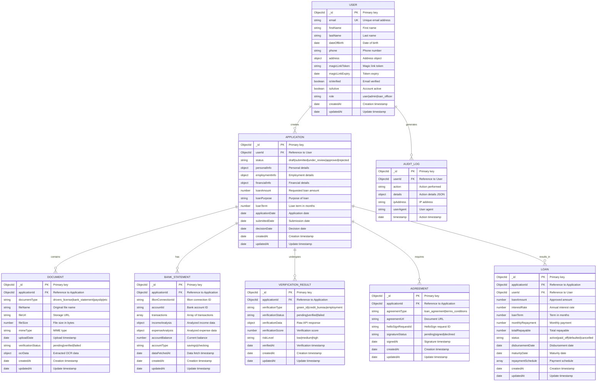

# 📚 PROJECT KNOWLEDGE - Single Source of Truth (SSOT)

**Last Updated:** 2026-02-08 11:32:00  
**Framework Version:** 1.0.0  
**Project Type:** Consumer Lending App (Australian Market)
**Status:** Ready for Sprint Execution

---

## 1️⃣ BUSINESS REQUIREMENTS

### Vision
Build a modern, compliant consumer lending platform for the Australian market that provides a seamless digital experience from application to loan disbursement.

### Target Market
- **Geography:** Australia
- **Customer Segment:** Individual consumers seeking personal loans ($5,000 - $50,000)
- **Compliance:** Australian Privacy Act 1988, Consumer Data Right (CDR), National Consumer Credit Protection Act 2009

### Key Features

#### Sprint 1: Core Authentication & Onboarding
- [x] Passwordless Authentication (Magic Link)
- [x] User Onboarding Flow (Multi-step wizard)
- [x] Driver License Upload & Storage (with OCR)
- [x] Green ID Integration (Identity verification)
- [x] Illion Bank Scrape Integration (Income/expense verification)
- [x] Bureau Credit Checks (Credit score retrieval)
- [x] Consumer Verification (Combine all checks)
- [x] Loan Decision Engine (Basic approval logic)

#### Sprint 2: Advanced Verification
- [ ] Enhanced Green ID verification with additional documents
- [ ] Comprehensive bureau credit check analysis
- [ ] Detailed income verification via Illion
- [ ] Risk scoring engine
- [ ] Fraud detection rules

#### Sprint 3: Loan Processing
- [ ] Loan application workflow management
- [ ] Document signing integration (HelloSign)
- [ ] Advanced loan decision engine
- [ ] Approval workflow with human review
- [ ] Loan offer generation

#### Sprint 4: Dashboard & Reporting
- [ ] User dashboard for application tracking
- [ ] Document management interface
- [ ] Admin panel for loan officers
- [ ] Reporting and analytics

#### Sprint 5: Polish & Deploy
- [ ] Performance optimization
- [ ] Security hardening
- [ ] Production deployment
- [ ] Monitoring and alerting setup

### User Stories (Sprint 1)

#### US-1: Passwordless Authentication
**As a** user  
**I want to** log in using a magic link sent to my email  
**So that** I don't need to remember passwords and have a more secure experience

**Acceptance Criteria:**
- User can enter email address on login page
- System sends magic link to provided email within 30 seconds
- Magic link is valid for 15 minutes
- User clicks link and is automatically authenticated
- JWT token is issued for subsequent API requests
- User is redirected to dashboard after successful authentication

**Technical Requirements:**
- Express route: `POST /api/auth/request-magic-link`
- Express route: `GET /api/auth/verify-magic-link/:token`
- MongoDB User model with `magicLinkToken` and `magicLinkExpiry` fields
- Email service integration (SendGrid or Mailgun)
- JWT token generation and validation

#### US-2: User Onboarding Flow
**As a** new user  
**I want** a guided onboarding process  
**So that** I can provide my information step-by-step without feeling overwhelmed

**Acceptance Criteria:**
- Multi-step form with clear progress indicator
- Step 1: Personal Information (name, DOB, contact)
- Step 2: Employment Information (employer, income, employment type)
- Step 3: Document Upload (driver license, payslip)
- Step 4: Review and Submit
- Ability to save progress and resume later
- Form validation at each step
- Clear error messages for invalid inputs

**Technical Requirements:**
- React component: `OnboardingWizard`
- Sub-components: `PersonalInfoStep`, `EmploymentStep`, `DocumentUploadStep`, `ReviewStep`
- Express route: `POST /api/applications`
- Express route: `PUT /api/applications/:id` (save progress)
- MongoDB Application model

#### US-3: Driver License Upload & OCR
**As a** user  
**I want to** upload my driver license  
**So that** my identity can be verified automatically

**Acceptance Criteria:**
- User can upload driver license (front and back)
- Supported formats: JPG, PNG, PDF (max 5MB each)
- OCR extracts: name, license number, date of birth, address
- Extracted data pre-fills form fields
- User can correct OCR errors before submission
- Uploaded documents are securely stored

**Technical Requirements:**
- File upload with validation
- OCR integration (Tesseract.js or AWS Textract)
- Express route: `POST /api/documents/upload`
- Document storage (AWS S3 or similar)
- MongoDB Document model

#### US-4: Green ID Integration
**As a** system administrator  
**I want** to verify user identity using Green ID  
**So that** we comply with KYC/AML regulations

**Acceptance Criteria:**
- System calls Green ID API with user details
- Green ID returns verification result (verified, not verified, manual review)
- Verification status is stored with application
- User is notified of verification result
- Failed verifications trigger manual review

**Technical Requirements:**
- Green ID API integration
- Express route: `POST /api/verifications/green-id`
- VerificationResult model
- Error handling for API failures

#### US-5: Illion Bank Scrape Integration
**As a** user  
**I want to** connect my bank account securely  
**So that** my income and expenses can be verified automatically

**Acceptance Criteria:**
- User initiates Illion connection
- User is redirected to Illion portal
- User authenticates with their bank
- System retrieves 90 days of transaction history
- Income and expenses are analyzed
- Results are displayed to user

**Technical Requirements:**
- Illion API integration
- Express route: `POST /api/verifications/illion-connect`
- Express route: `GET /api/verifications/illion-callback`
- BankStatement model
- Transaction analysis logic

#### US-6: Bureau Credit Check
**As a** loan officer  
**I want** to retrieve applicant's credit score  
**So that** I can assess creditworthiness

**Acceptance Criteria:**
- System calls credit bureau API (Equifax/Experian)
- Credit score and report are retrieved
- Results are stored securely
- Only authorized users can view credit reports
- Audit trail is maintained for credit checks

**Technical Requirements:**
- Credit bureau API integration
- Express route: `POST /api/verifications/credit-check`
- VerificationResult model
- Access control and audit logging

#### US-7: Loan Decision Engine
**As a** system  
**I want** to automatically approve or decline loan applications  
**So that** decisions are made quickly and consistently

**Acceptance Criteria:**
- Decision engine considers: credit score, income, expenses, employment status
- Automatic approval for low-risk applicants
- Automatic decline for high-risk applicants
- Manual review for medium-risk applicants
- Decision rationale is logged
- Applicant is notified of decision

**Technical Requirements:**
- Loan decision service
- Express route: `POST /api/loans/decision`
- Decision rules engine
- Loan model
- Notification service

---

## 2️⃣ SCHEMA DESIGN (MongoDB ERD)

### Database: `consumer_lending_db`



### Mongoose Models Location
- **Backend Path:** `src/backend/models/`
- **Models:**
  - `User.js` - User authentication, profile, and magic link
  - `Application.js` - Loan application management
  - `Document.js` - Document upload and verification
  - `BankStatement.js` - Illion bank data
  - `VerificationResult.js` - Identity and credit verification
  - `Agreement.js` - Loan agreements and signatures
  - `Loan.js` - Active loan management
  - `AuditLog.js` - Compliance audit trail

### API Endpoints

#### Authentication
- `POST /api/auth/request-magic-link` - Request magic link
- `GET /api/auth/verify-magic-link/:token` - Verify and authenticate
- `POST /api/auth/logout` - Logout
- `GET /api/auth/me` - Get current user

#### Applications
- `POST /api/applications` - Create application
- `GET /api/applications/:id` - Get application
- `PUT /api/applications/:id` - Update application
- `POST /api/applications/:id/submit` - Submit application
- `GET /api/applications/user/:userId` - Get user applications

#### Documents
- `POST /api/documents/upload` - Upload document
- `GET /api/documents/:id` - Get document
- `DELETE /api/documents/:id` - Delete document
- `POST /api/documents/:id/verify` - Trigger verification

#### Verifications
- `POST /api/verifications/green-id` - Green ID verification
- `POST /api/verifications/credit-check` - Credit bureau check
- `POST /api/verifications/illion-connect` - Connect Illion
- `GET /api/verifications/:applicationId` - Get verifications

#### Loans
- `POST /api/loans/decision` - Run decision engine
- `GET /api/loans/:id` - Get loan details
- `GET /api/loans/user/:userId` - Get user loans
- `PUT /api/loans/:id/repayment` - Record repayment

#### Agreements
- `POST /api/agreements` - Create agreement
- `POST /api/agreements/:id/sign` - Initiate signing
- `GET /api/agreements/:id/status` - Check status

---

## 3️⃣ CURRENT ITERATION STATUS

**Current Sprint:** Sprint 1 - Core Authentication & Onboarding  
**Sprint Duration:** 2 weeks  
**Start Date:** 2026-02-08  
**Target Completion:** 2026-02-22

| Phase | Status | Assigned Agent | Notes |
|-------|--------|-----------------|-------|
| **Discovery** | ✅ Complete | 01_Requirement_Agent | User stories defined for Sprint 1 |
| **Architecture** | ✅ Complete | 02_System_Architect | MongoDB schema and API contracts defined |
| **Planning** | 🟡 Ready | 03_Implementation_Planner | Awaiting approval gate |
| **Development** | ⏳ Pending | 04_FullStack_Dev_Swarm | Blocked until plan approved |
| **Testing** | ⏳ Pending | 05_Quality_Assurance | Blocked until dev complete |
| **Security Review** | ⏳ Pending | 06_Security_Sentinel | Blocked until testing passes |

### Sprint 1 Task Breakdown

#### Backend Development (40 hours)
- [ ] Setup Express.js project with TypeScript (2h)
- [ ] Configure MongoDB connection and environment variables (1h)
- [ ] Implement User model with magic link fields (2h)
- [ ] Implement Application model (3h)
- [ ] Implement Document model (2h)
- [ ] Implement BankStatement model (2h)
- [ ] Implement VerificationResult model (2h)
- [ ] Implement Loan model (2h)
- [ ] Implement AuditLog model (1h)
- [ ] Create auth routes and controller (4h)
- [ ] Create application routes and controller (4h)
- [ ] Create document routes and controller (3h)
- [ ] Create verification routes and controller (4h)
- [ ] Implement email service for magic links (2h)
- [ ] Implement Green ID integration service (4h)
- [ ] Implement Illion integration service (4h)
- [ ] Implement credit bureau integration service (3h)
- [ ] Implement loan decision engine (4h)
- [ ] Add authentication middleware (2h)
- [ ] Add validation middleware (2h)
- [ ] Add error handling middleware (1h)

#### Frontend Development (35 hours)
- [ ] Setup React project with Vite and TypeScript (2h)
- [ ] Configure Tailwind CSS and routing (1h)
- [ ] Create Login page (2h)
- [ ] Create MagicLinkSent page (1h)
- [ ] Create Onboarding page with wizard (5h)
- [ ] Create PersonalInfoStep component (2h)
- [ ] Create EmploymentStep component (2h)
- [ ] Create DocumentUploadStep component (3h)
- [ ] Create ReviewStep component (2h)
- [ ] Create Dashboard page (3h)
- [ ] Create ApplicationDetails page (3h)
- [ ] Create Documents page (2h)
- [ ] Implement AuthContext (2h)
- [ ] Implement ApplicationContext (2h)
- [ ] Create authService (2h)
- [ ] Create applicationService (2h)
- [ ] Create documentService (2h)
- [ ] Create verificationService (1h)
- [ ] Add form validation (2h)
- [ ] Add loading and error states (1h)

#### Testing (25 hours)
- [ ] Backend unit tests for models (4h)
- [ ] Backend unit tests for controllers (6h)
- [ ] Backend integration tests for API endpoints (8h)
- [ ] Frontend component tests (5h)
- [ ] E2E tests for critical flows (4h)

#### Documentation & Config (5 hours)
- [ ] Create .env.example files (1h)
- [ ] Write API documentation (2h)
- [ ] Write deployment guide (1h)
- [ ] Write user guide (1h)

**Total Estimated Effort:** 105 hours (13 working days for single developer)

---

## 4️⃣ DECISION LOG

### Decision #1: Technology Stack Selection
- **Date:** 2026-02-08
- **Decision:** Use Node.js/Express + React + MongoDB
- **Rationale:** 
  - JavaScript full-stack enables rapid development
  - MongoDB provides flexible schema for evolving requirements
  - React ecosystem mature with excellent tooling
  - Large talent pool for JavaScript developers
- **Alternatives Considered:**
  - Python/FastAPI + Vue.js (Learning curve for team)
  - Go + Next.js (Limited MongoDB ODM options)
- **Owner:** Chief Enterprise Architect

### Decision #2: Passwordless Authentication
- **Date:** 2026-02-08
- **Decision:** Use magic link authentication instead of traditional passwords
- **Rationale:**
  - Better user experience (no password to remember)
  - More secure (no password to steal or crack)
  - Reduces support burden (no password reset requests)
  - Modern approach aligned with industry trends
- **Alternatives Considered:**
  - Traditional email/password (outdated, security risks)
  - OAuth only (requires social accounts)
  - SMS OTP (expensive, SMS interception risks)
- **Owner:** Security Sentinel + Product Owner

### Decision #3: Australian Market Focus
- **Date:** 2026-02-08
- **Decision:** Build specifically for Australian market with local compliance
- **Rationale:**
  - Clear regulatory framework (NCCP Act)
  - Strong consumer protection laws provide competitive advantage
  - Local integration partners (Green ID, Illion) available
  - Underserved market segment
- **Owner:** Product Owner

### Decision #4: Green ID for Identity Verification
- **Date:** 2026-02-08
- **Decision:** Use Green ID as primary identity verification provider
- **Rationale:**
  - Australian-focused with local data sources
  - Comprehensive verification (DVS, AML, credit header)
  - Strong reputation and reliability
  - Good API documentation and support
- **Alternatives Considered:**
  - Onfido (global focus, less Australian optimization)
  - Manual verification (slow, expensive, error-prone)
- **Owner:** System Architect

### Decision #5: Illion for Bank Data
- **Date:** 2026-02-08
- **Decision:** Use Illion for bank account connection and analysis
- **Rationale:**
  - CDR-compliant data access
  - Good coverage of Australian banks
  - Transaction categorization and analysis features
  - Established player with reliable API
- **Alternatives Considered:**
  - Basiq (similar offering, chose Illion for better support)
  - Direct bank APIs (too complex, maintenance burden)
- **Owner:** System Architect

### Decision #6: Security Protocol
- **Date:** 2026-02-08
- **Decision:** Enforce .env file with NO hardcoded secrets
- **Rationale:** 
  - Prevents accidental exposure in Git commits
  - Allows different configs per environment
  - Aligns with 12-factor app methodology
  - Simplifies secure secret management
- **Owner:** 06_Security_Sentinel

### Decision #7: Human-in-the-Loop Gates
- **Date:** 2026-02-08
- **Decision:** Mandatory approval at 2 points: Planning, Security Audit
- **Rationale:**
  - Prevents rogue agent execution
  - Maintains business alignment
  - Catches security issues early
  - Ensures human oversight of critical decisions
- **Owner:** 03_Implementation_Planner

### Decision #8: Test Coverage Threshold
- **Date:** 2026-02-08
- **Decision:** Require minimum 80% code coverage for backend and frontend
- **Rationale:**
  - Ensures adequate testing of critical paths
  - Catches regressions early
  - Industry standard for production applications
  - Balances thoroughness with development speed
- **Owner:** 05_Quality_Assurance

---

## 5️⃣ AGENT COMMUNICATION LOG

```
[2026-02-08 11:32:00 - Sprint 1 Initialized]
✓ Framework configured for consumer-lending-app
✓ BA Agent loaded Sprint 1 requirements
✓ System Architect defined schema for 8 models
✓ System Architect defined 25+ API endpoints
✓ All agents registered and ready
✓ PROJECT_KNOWLEDGE.md updated with complete requirements
→ Ready to execute Planning Phase with human approval gate

[Next: Implementation Planner will break Sprint 1 into tasks]
```

---

## 6️⃣ INTEGRATION SPECIFICATIONS

### Green ID Integration
**Endpoint:** `https://api.greenid.com.au/v3/`  
**Authentication:** API Key + Secret  
**Purpose:** Australian identity verification

**Verification Process:**
1. Submit user details (name, DOB, address, license number)
2. Green ID checks against DVS (Document Verification Service)
3. Performs AML (Anti-Money Laundering) checks
4. Returns verification result with sources

**Required Fields:**
- givenName, surname, dateOfBirth
- currentResidentialAddress
- australianDriversLicence (state, number, cardNumber)

**Response Fields:**
- verificationResult (VERIFIED, NOT_VERIFIED, PENDING)
- verificationSources (list of data sources checked)
- overallVerificationStatus

### Illion Integration
**Endpoint:** `https://api.illion.com.au/`  
**Authentication:** OAuth 2.0  
**Purpose:** Bank account connection and transaction analysis

**Connection Process:**
1. Generate authorization URL
2. Redirect user to Illion portal
3. User authenticates with bank
4. Receive callback with connection ID
5. Fetch transaction data

**Data Retrieved:**
- 90 days of transaction history
- Account balance and type
- Income analysis (salary, benefits)
- Expense categorization

**Analysis Features:**
- Regular income detection
- Expense categorization (rent, utilities, groceries, etc.)
- Spending patterns
- Financial health score

### Credit Bureau Integration
**Endpoint:** Equifax/Experian API  
**Authentication:** API credentials  
**Purpose:** Credit score and report retrieval

**Request Fields:**
- Full name, date of birth
- Current address
- Driver license or passport number

**Response Fields:**
- Credit score (0-1000 scale)
- Credit enquiries (last 5 years)
- Defaults and court judgments
- Credit accounts summary

### HelloSign Integration
**Endpoint:** `https://api.hellosign.com/v3/`  
**Authentication:** API Key  
**Purpose:** Digital document signing

**Signing Process:**
1. Create signature request with PDF document
2. Add signer details (email, name)
3. HelloSign sends email to signer
4. Receive webhook on signature completion
5. Download signed document

---

## 7️⃣ COMPLIANCE & SECURITY REQUIREMENTS

### Australian Privacy Act 1988
- ✅ Obtain explicit consent before collecting personal information
- ✅ Disclose purpose of data collection
- ✅ Allow users to access and correct their data
- ✅ Protect data with reasonable security measures
- ✅ Only use data for stated purposes
- ✅ Retain data only as long as necessary

### Consumer Data Right (CDR)
- ✅ Use accredited data recipient (Illion)
- ✅ Obtain user consent for data sharing
- ✅ Comply with data standards
- ✅ Provide data deletion on request
- ✅ Maintain audit trails

### National Consumer Credit Protection Act 2009
- ✅ Responsible lending obligations
- ✅ Assess borrower's financial situation
- ✅ Verify income and expenses
- ✅ Ensure loan is not unsuitable
- ✅ Provide pre-contractual disclosure
- ✅ Maintain records for 7 years

### Security Requirements
- ✅ HTTPS for all communications
- ✅ JWT tokens for authentication
- ✅ Password hashing with bcrypt (if used)
- ✅ Rate limiting on sensitive endpoints
- ✅ Input validation and sanitization
- ✅ SQL/NoSQL injection prevention
- ✅ XSS protection
- ✅ CSRF protection
- ✅ Secure file upload handling
- ✅ Audit logging for all sensitive actions
- ✅ Encryption at rest for sensitive data
- ✅ Regular security updates

---

## 📝 NOTES FOR HUMAN REVIEWERS

1. **Sprint 1 Ready:** All requirements and architecture defined for Sprint 1
2. **Next Step:** Run orchestrator with `node orchestrator.js --sprint 1`
3. **Approval Gates:** You'll be prompted at Planning and Security phases
4. **Code Generation:** Agents will generate complete production-ready code
5. **Testing:** Automated tests will ensure 80%+ coverage
6. **Deployment:** Code ready for push to consumer-lending-app repository

### Quick Start Commands

```bash
# Run orchestrator for Sprint 1
node orchestrator.js --sprint 1 --project-type consumer-lending-app

# Run orchestrator with custom target repo
TARGET_REPO=https://github.com/your-org/your-repo node orchestrator.js

# View help
node orchestrator.js --help
```

---

**Status Indicator:** 🟢 READY_FOR_SPRINT_EXECUTION
**Target Repository:** https://github.com/mohitkesarwani/consumer-lending-app
